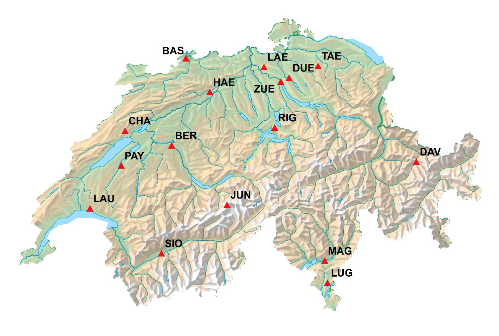

# Analysis of Swiss National Air Pollution Monitoring Network (NABEL) Measurements

This module contains exercises for analyzing NABEL air quality monitoring network data (Switzerland) in the Air Pollution and Climate Change (ENV-400) Masters class at EPFL. Students are assumed to have a little programming background, mostly in MATLAB/GNU Octave. 

<figure>

</figure>
<figcaption>
Image source: *Stations de mesure NABEL* report available at [this site](http://www.bafu.admin.ch/luft/00612/00625/index.html?lang=en)
</figcaption>

 

In many fields of environmental engineering, a central task is to make sense of large amounts of monitoring data. We wish to summarize these observations in ways that are useful to a) scientists and b) people who make regulatory decisions. To this end, this module introduces methods for generating concise descriptions of temporal and spatial patterns (of individual variables or their relationships), and explaining changes in concentrations due to emissions and atmospheric processes. We introduce some useful concepts for structuring and operating on such data sets that will facilitate exploratory analysis and rapid testing of hypotheses.

Topics addressed are the following:

1. <a href="http://rawgit.com/stakahama/aprl-env400-assignment/master/contents/01_Rintro.html" target="_blank">Motivating Example</a>
2. <a href="http://rawgit.com/stakahama/aprl-env400-assignment/master/contents/02_projectdef.html" target="_blank">Assignment definition</a>
3. <a href="http://rawgit.com/stakahama/aprl-env400-assignment/master/contents/03_Rbasics.html" target="_blank">R basics</a>
4. <a href="http://rawgit.com/stakahama/aprl-env400-assignment/master/contents/04_tseriesviz.html" target="_blank">Visualizing time series</a>
5. <a href="http://rawgit.com/stakahama/aprl-env400-assignment/master/contents/05_correlations.html" target="_blank">Correlations and cross-correlations</a>
6. <a href="http://rawgit.com/stakahama/aprl-env400-assignment/master/contents/06_signal.html" target="_blank">Autocorrelation and periodicity</a>
7. <a href="http://rawgit.com/stakahama/aprl-env400-assignment/master/contents/07_stochastic.html" target="_blank">Stochastic processes and random variables</a>
8. <a href="http://rawgit.com/stakahama/aprl-env400-assignment/master/contents/08_inferential.html" target="_blank">Inferential statistics and hypothesis testing</a>
9. <a href="http://rawgit.com/stakahama/aprl-env400-assignment/master/contents/09_extremevals.html" target="_blank">Extreme values: detection and accommodation</a>
10. <a href="http://rawgit.com/stakahama/aprl-env400-assignment/master/contents/10_wind.html" target="_blank">Considering meteorology (wind directions)</a>

Notes on the using R with this course:

* Unless you already have a favorite text editor or IDE, we recommend interfacing with R through [RStudio](http://rstudio.com/), which you can also download on your own machine. You can set `Sessions -> Set Working Directory -> To Source File Location` so that input/output of files will be managed through this working directory on your computer. 
* The R code in this module is partially written with pedagogical intentions, so may not be the most efficient. 
* Calls to `library(dplyr)` and `library(ggplot2)` shown in these examples can now be replaced with `library(tidyverse)`, and formatting functions within the `reshape2` package can be replaced with dplyr functions (e.g., `gather()` and `spread()`).

The module complements [lectures](https://moodle.epfl.ch/course/view.php?id=13241) on the mechanisms of emission, atmospheric chemical processes, and measurement techniques for these pollutants drawn from seminal textbooks on the subject:

* Cooper, C. David, and Alley, F. C. *Air Pollution Control: A Design Approach*. Waveland Press Inc., 2011.
* Finlayson-Pitts, Barbara J., and Pitts Jr., James N. *Chemistry of the Upper and Lower Atmosphere: Theory, Experiments, and Applications*. Academic Press, 1999.
* Flagan, Richard C. and Seinfeld, John H. *Fundamentals of Air Pollution Engineering*. Prentice Hall, Inc., New Jersey, 1988. Available online: http://authors.library.caltech.edu/25069/
* Friedlander, Sheldon K. *Smoke, Dust, and Haze: Fundamentals of Aerosol Dynamics*. Oxford University Press, 2000.
* Jacob, Daniel Introduction to Atmospheric Chemistry. Princeton University Press, 1999. Available online: http://acmg.seas.harvard.edu/people/faculty/djj/book/
* Hinds, William C. *Aerosol Technology: Properties, Behavior, and Measurement of Airborne Particles*. Wiley, 1999.
* Kulkarni, Pramod, Baron, Paul A., and Willeke, Klaus. *Aerosol Measurement: Principles, Techniques, and Applications*. John Wiley & Sons, 2011.
* Seinfeld, John H. and Pandis, Spyros N. *Atmospheric Chemistry and Physics: From Air Pollution to Climate Change*. John Wiley & Sons, 3rd ed., New York, 2016.
* Wark, Keith, Warner, Cecil F., and Davis, Wayne T. *Air Pollution: Its Origin and Control*. Addison-Wesley, 3rd ed., 1998.

