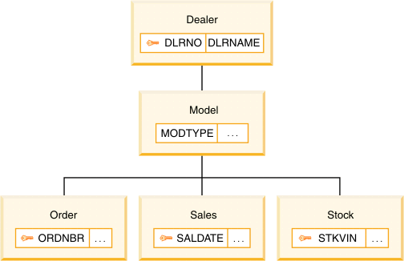
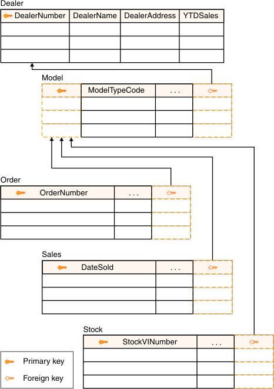
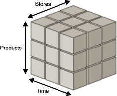
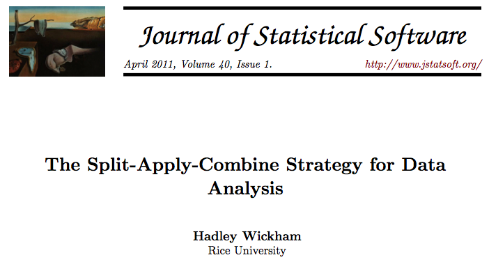

```{r, include=FALSE}
library(knitr)
opts_chunk$set(fig.path='figures_rmd/lec02_', fig.align='center')
```

# Structure of air quality (and many types of environmental) data

Air pollution data (observations or model predictions) consist of realizations of multiple variables in time and space. How can we structure this data so that we may efficiently apply simple statistical analyses on them? In general, the goal of statistical analysis can be thought of as having two products:

* statistical description (providing a few metrics which represent a large quantity of values)
* statistical inference (which includes hypothesis testing to infer properties of a population, and predictions resulting from inferred characteristics of variables or relationships among them)

In this project, we will learn methods of exploratory data analysis using relational models of data. We will cover the software package R.

# Assignment definition


The assignment is to analyze measurements from the Swiss Federal Office of the Environment (BAFU/OFFEV/FOEN) network. The objective is to observe seasonal and diurnal patterns in concentrations of each pollutant, and understand the interplay of emissions, photochemistry, and meteorology that gives rise to these patterns to the extent that they can be inferred.

Write a report on the following content. You can find many details on the [BAFU website](http://www.bafu.admin.ch/luft/index.html?lang=en), and in the lectures of the course.

<hr style="height:1px;border:none;color:#333;background-color:#333;">

Describe each instrument used to measure air pollutants.

1. What is the physical or chemical principle behind their measurement? What are potential biases or errors in each type of measurement?

Select two monitoring stations located in contrasting locations (urban vs. rural), and download their hourly concentrations for 2015. 

Describe the concentration of pollutants:

2. Contrast the monthly averages of each regulated pollutant and
meteorological variable between the two sites. Describe seasonal differences
and possible reasons for the variations, referring to figures and
relevant values that have been calculated.
3. Contrast the weekday and weekend differences in diurnal (hourly)
averages of each regulated pollutant and meteorological variable
between the two sites. Describe differences and possible reasons for
the variations, referring to figures and relevant values that have
been calculated.
4. Describe periods which lie out of usual patterns (describe a few).
5. Determine whether regulatory limits are met or exceeded for each pollutant. Identify periods in which regulatory limits are exceeded and determine whether any cause can be attributed to these events to the extent that you can tell from your data set.

You may wish to use:

* estimation of central values (mean or median), metrics of dispersion (summary statistics)
* histograms, kernel density estimates, empirical cumulative distribution function
* statistical significance of differences in average values (means)

Examine correlations and lagged correlations among variables. This does not have to be exhaustive (let's agree on presenting 3 correlations), but begin with a hypothesis of what *should* be correlated according to cause and effect, and support or discredit it with your analysis.

6. Which variables show mild to strong correlations with each other for which sites and time periods?
7. Give (physically) plausible reasons why these correlations might exist. Do they share a causal relationship, or are they dependent on a third confounding variable (e.g., common source of emissions or photochemistry).

Determine if pollutant concentrations are lognormally distributed for 1) hourly-averaged concentrations or 2) daily-averaged concentrations.

8. Explain if these distributions are reasonable to expect for each species and for each site. You may select one month out of the year for inspection.

Note that the main theme is to discuss variation of pollutant concentrations in terms of emissions and atmospheric processes.

<hr style="height:1px;border:none;color:#333;background-color:#333;">

# Lesson outline

1. Motivating example
2. Assignment definition [we are here]
3. R basics
4. Visualizing time series
5. Correlations and cross-correlations
6. Autocorrelation and periodicity
7. Stochastic processes and random variables
8. Inferential statistics and hypothesis testing
9. Extreme values: detection and accommodation

# Data analysis

*Data analysis* describes the process of reducing a set of data to a few relevant conclusions.  
  
*Code* describes data (e.g., measurements) and its transformations (e.g., averaging).

* Data are stored as variables (nouns)
* Transformations are described through functions (verbs)

Structuring your data appropriately can significantly reduce the number of steps required for many types of transformations.
  
## Examples of data models

Data models describe entities and their relationships to other entities.

* Graph (Hierarchical, Network)
* Relational
* "Multidimensional" cube model

<table>
<tr>
<td></td>
<td></td>
<td></td>
</tr>
</table>

These models can be implemented by databases in data warehouses, or data structures residing in local memory.

Array representation in R:
```{r, echo=FALSE}
ReadTSeries <- function(filename, timecolumn="datetime", timeformat="%d.%m.%Y %H:%M") {
  library(chron)
  ## read the table
  data <- read.table(filename, skip=5, header=TRUE, sep=";", check.names=FALSE)
  names(data) <- sub("[ ].*$","",names(data))
  names(data) <- sub("Date/time", timecolumn, names(data), fixed=TRUE)
  data[,timecolumn] <- as.chron(data[,timecolumn], timeformat)
  ## additional variables
  data[,"year"] <- years(data[,timecolumn])
  data[,"month"] <- months(data[,timecolumn])
  data[,"day"] <- days(data[,timecolumn])
  data[,"hour"] <- hours(data[,timecolumn])
  data[,"dayofwk"] <- weekdays(data[,timecolumn])
  data[,"daytype"] <- ifelse(data[,"dayofwk"] %in% c("Sat","Sun"),"Weekend","Weekday")
  ##
  seasons <- c("DJF","MAM","JJA","SON")
  ix.seasons <- findInterval(unclass(data[,"month"]) %% 12, seq(0,12,3))
  data[,"season"] <- factor(seasons[ix.seasons],seasons)
  ## avoid package conflict
  data[,timecolumn] <- c(unclass(data[,timecolumn]))
  ## return value
  data
}
```

```{r, echo=FALSE}
library(reshape2)
df <- ReadTSeries("data/2013/LAU.csv")
lf <- melt(df, c("datetime", "season", "year","month","day","hour","dayofwk","daytype"))
arr <- unclass(by(lf[["value"]], lf[c("year", "month", "day", "hour", "variable")], identity))
```

```{r}
dimnames(arr)
arr["2013","Jul","20",,"O3"]
```

Some operations can be efficiently performed with arrays:
```{r}
apply(arr["2013",,,,],MARGIN=c("month","variable"), FUN=mean, na.rm=TRUE)
```

Hierarchical representation:
```{r, echo=FALSE}
Recursetree <- function(x) 
  lapply(split(x[,-1],x[,1]), Recursenode)

Recursenode <- function(x) {
  (if(is.null(dim(x))) x
   else Recursetree(x))
}

tree <- Recursetree(lf[c("year", "month", "day", "hour", "variable", "value")])
```

```{r}
tree[["2013"]][["Jul"]][["20"]][c("11","12")]
```


## Data tables


Relations with 2-D structure ("a multiset of tuples").

* Observations along rows (identified by unique "keys")
* Variables along columns

Like matrices, but different:

* Can be a collection of heterogeneous data types along columns: float, integer, string, Boolean, etc.
* The set of operations defined for tables contain ones which are different from matrices. For instance:
  * matrices: scalar, matrix, Hadamard, and Kronecker products; transpose, determinant, decomposition (e.g., SVD), ``slice'' (equivalent of subset/select for tables)
  * tables: join, group, subset (observations), select (variables)


## Example

Import example data:
```{r, echo=FALSE}
data <- read.table("data/2013/LAU.csv", sep=";", skip=6,
  col.names=c("datetime","O3","NO2","CO","PM10","TEMP","PREC","RAD"))
```

View in "wide" format:
```{r}
kable(data[1:2,])
```

Convert to "long" format:
```{r}
library(reshape2) # makes melt() library available
kable(melt(data[1:2,], id.vars="datetime"))
```

The transformation from the wide format to long format as shown above (and vice versa) is known as "pivoting". Other common operations with data tables include:

* extracting columns and rows
* joining (merging) two tables

## Split-apply-combine (SAC) strategy

Data tables permit a set of operations common to many types of data analyses.



General strategy:

1. *split* table row-wise by a categorical variable (X)
2. *apply* function (Y) on selected variable
3. *combine* results into another table
  
Example (as shown in Lesson 1):
  
1. *split* table row-wise by month
2. *apply* mean on selected variable
3. *combine* summary statistics (i.e., mean) into a table

The basic syntax for SAC and describing a graphic in R can be similar in structure.

To return a data table after grouping rows of another data table by \cverb=variable1, variable2=; applying \cverb=cor= to each piece, and recombining:
```{r, eval=FALSE}
library(dplyr)
data_table %>%                             # data table
  group_by(variable1,varaible2) %>%        # grouping variables
    summarize(correlation=cor(x,y))        # (aggregating) function
```

There are *many* variations on this specification, but this is the general idea for creating a graphic:
```{r, eval=FALSE}
library(ggplot2)
ggplot(data=data_table) +                  # data table
  facet_grid(variable1~variable2) +        # grouping variables
    geom_line(mapping=aes(x,y,color=z))    # aesthetics
```

The last example shows the application of a popular programming concept for graph specification. We will show more such examples in the following lessons.


