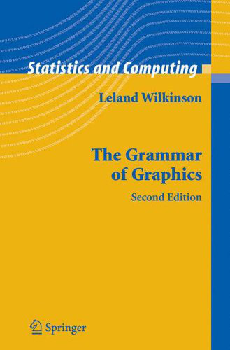
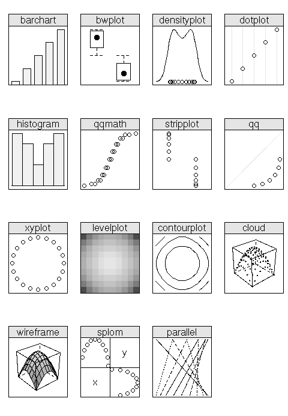

```{r, include=FALSE}
library(knitr)
opts_chunk$set(fig.path='figures_rmd/lec03', fig.align='center')
```

# Programming with data using R

In order to perform the data analysis, we need a tool to help us 

* clean and transform the data, 
* visualize our data to generate hypotheses and confirm that assumptions required for statistical tests are met (e.g., normality), and 
* apply the tests and harvest results.

R is such a tool that was created for "Programming with Data", and will be covered in this lesson. 

* We will cover some basic concepts of R programming in this course, with an emphasis on demonstrating *what* you can (or should) do with a programming language. Once you know this, you can look up *how* to perform a specific task. 

* Many demonstrations and example code will be provided. If you find a code block that accomplishes what you need, then you can use it directly or read up on the function or functions to adapt the block to your needs.
* Everyone has a different level of background in programming, but it is possible to find appropriate resources at every level.
* Find the resource that speaks to your background and way of thinking (e.g., some tutorials are aimed at engineers, while others are aimed at computer scientists, statisticians, economitricians, psychologists, and so on).

We will require each student to learn a lot on his or her own as it is not possible to exhaustively cover every function or operation used in our exmaples. As you will see, the actual number of resources to learn R is endless (just type "introduction to R" in Google), which then leads to a tyranny of choice and decision fatigue. We might recommend a very few resources:

* Introduction to language basics:
    * *(very) short introduction to R*
    * *An Introduction to R*
    * *R Inferno*
* Working with data
    * *Modern Applied Statistics with S*
    * *Data Manipulation with R*
  


One strategy (for learning a new topic in general) is to skim the contents of many resources and identify:

* common topics that come up in every tutorial
* topics that are of interest for solving your problem
* authors that explain concepts using analogies that are relevant to you or your prior training

We will present a few examples to initiate a user generally familiar with a limited amount of programming. Basic classifications to keep in mind.

Important "data types" (objects):

* data frame
* lists/vectors (ordered/labeled collection of objects)

Everything in R is technically a "vector" with different or additional attributes such as storage mode, dimension, etc.

Important classes of operations:

* data selection
* data merging
* arithmetic operations
* statistical analysis
* graphics
* text processing
* shell scripting
* flow control

Important features when working with real data:

* handling of missing values


# Overview


* R is a programming language
* R is a statistical package
* R is object-oriented
* R is derived from S, a predecessor language used by the statistics community (overall has 30+ year history)
* R is available through GNU Public License
* R is used professionally in academia and industry; particularly in machine learning communities

One of its core-strengths is the collection of user-contributed libraries. You will find that R permits *many* ways to do the same thing. Find the way that works best for you (and your colleagues), and stick with it.


## R for the MATLAB user

Superficial differences:

* Comment character is `#` rather than `%`.
* Arrows `<-` are assignment operators. (Can also use equal sign in most places.)
* `*`, `/`, `^` operate element-wise (like `.*`, `./`, `.^` in MATLAB).
* Functions do not have to be defined in separate files.
* Most operations are performed by calling a function on arguments. Functional calls are very forgiving, and arguments can be specified by 1) order provided or 2) partial matching of argument names.

    ```
    > divide <- function(numerator,denominator) numerator / denominator
    > divide(1,2)
    [1] 0.5
    > divide(denominator=1,numerator=2)
    [1] 2
    > divide(d=1,2)
    [1] 2
    ```
* Same control structures exist---`if`, `for`, `while`, etc.---but braces `{}` denote extent of expressions, rather than `end` statements.

Check out:

* [http://mathesaurus.sourceforge.net/octave-r.html](http://mathesaurus.sourceforge.net/octave-r.html)
* [https://cran.r-project.org/doc/contrib/Hiebeler-matlabR.pdf](https://cran.r-project.org/doc/contrib/Hiebeler-matlabR.pdf)

# Basics

For the rest of the examples, we will assume the following libraries have been imported and options set:

```{r, message=FALSE}
library(dplyr)
library(reshape2)
library(chron)
library(ggplot2)
```

```{r}
source("GRB001.R")
```

```{r, results="hide"}
Sys.setlocale("LC_TIME","C")
options(stringsAsFactors=FALSE)
options(chron.year.abb=FALSE)
theme_set(theme_bw()) # just my preference for plots
```

These libraries should be present on the machines in room GRB001. On your own machine, you can install necessary packages from the web:
```
install.packages("packagename",repos="http://stat.ethz.ch/CRAN/")
```
or, for multiple packages at once, 
```
install.packages(c("packagename1","packagename2"),repos="http://stat.ethz.ch/CRAN/")
```
and so on.

In the *assignment* of values to symbols/variables, `<-` or `=` can be used. The former method is recommended.

    ```{r}
    x <- 1   # scalar (a vector of length 1)
    x = 1   
    x <- 1:5 # vector
    x = 1:5 
    ```

Functions accept a set of arguments (inputs) and return a value (output). Even binary operators can be written as a function in *prefix* notation -- e.g.,  x+1` is equivalent to ```+``(x,1)`.

## Variables (data types, objects)

Variables are symbols (e.g., `x`, `y`) that represent a set of values. These values can take on one of several types.

* simple ("atomic") data types: logical (Boolean), numeric (integer, real/double), complex, character (string), and raw
* complex structures can be composed of atomic data types: list, data.frame, factors

You can convert among data types with `as`: `as.data.frame`, `as.list`, `as.numeric`, `as.character`, and so on.

Lists are like cell arrays or structures in MATLAB.

As with MATLAB, R has vectorized operations. Vectorized operations are applicable for atomic data types, but not for "list". Example:
```{r}
x <- 1:5
y <- x+1
print(y)
mode(y)
typeof(y)
```
You can check the mode of your data type with `mode()` or `typeof()`.

Apart from the mode, objects can have dimensionality: 1-D (vector), 2-D (matrix), N-D (array).

Special data types:

* factor (categorical variable) (1-D)
* data frame (relational table) (2-D)


## Creating instances of vectors, matrices, lists, etc.

`c` *concatenates* elements and is often used to construct a vector.
```{r}
(char <- c("ab","d"))      # concatenate elements (character)
(v <- c(1,3,5))           # concatenate elements (numeric)
```

Other objects are created by functions that are named after the object.
```{r}
(m <- matrix(1:6,ncol=2)) # create a matrix
(l <- list(1,v,m))        # define a list
```

In contrast with MATLAB, Note that a single element in a character vector in R can contain multiple letters.

## Objects

An object defines both the 1) data type and 2) operations that are allowed on them, and is labeled by a "class".

Check the class of an R object by `class()`, and the functions allowed with `methods()`:
```{r}
x <- 1
print(class(x))
methods(class=class(x))
```

Alternatively, you can query what type of objects a function can operate on. For instance, we have a function called `mean()`:
```{r}
methods(mean)
```

In R, all variables are objects and all operations are functions. All functions are also objects.

## Labeling elements

Elements can have optional labels.
    
Vectors, lists can have names.
```{r}
(v <- c(a=1, b=3, c=5))
v["a"]
names(l) <- names(v)
print(l)
```

Matrices can have column and row names.
```{r}
colnames(m) <- letters[1:ncol(m)]
rownames(m) <- letters[1:nrow(m)]
print(m)
```

## Text processing

Processing strings of characters is a relevant part of data analysis. 

Manipulate strings:
```{r}
date <- "2012.03.01"
strsplit(date, ".", fixed=TRUE)
paste("2012", "03", "01", sep=".")
sprintf("%d.%02d.%02d",2012, 3, 1)
```

Search for strings:
```{r}
dates <- c("2012.03.01","2013.03.01")
grep("2012", date, fixed=TRUE)
grepl("2012", date, fixed=TRUE)
grep("2012", date, value=TRUE, fixed=TRUE)
```

To delve deeper, you will eventually want to look into [*regular expressions*](https://en.wikipedia.org/wiki/Regular_expression).
```{r}
pattern <- "([0-9]{4})\\.([0-9]{2})\\.([0-9]{2})"
sub(pattern, "\\1", dates)
sub(pattern, "\\2", dates)
sub(pattern, "\\3", dates)
```

Useful example:
```{r}
data <- read.table("data/2013/LAU.csv", skip=5, sep=";", header=TRUE, check.names=FALSE)
names(data)
```
Note non-ASCII encoding.

We can delete everything after whitespace: 
```{r}
sub("[ ].*$","",names(data))
```

With such functions, you can relable your data table columns without assigning them manually (note `fixed=TRUE` indicates that you are using fixed string patterns and not regular expressions).
```{r}
names(data) <- sub("[ ].*$","",names(data))
names(data) <- sub("Date/time", "datetime", names(data), fixed=TRUE)
```

Some text processing functions:
```
paste()
substr(); substring(); nchar()
strsplit()
sub(); gsub()
grep()
regexpr(); gregexpr() match(); pmatch(); %in% `==`
```

## Set operations

```{r}
newdate1 <- "2013.03.01"
newdate2 <- "2013.03.02"
union(newdate2, dates)
intersect(newdate2, dates)
intersect(newdate1, dates)
setdiff(dates, newdate1)
```

## Extract/replace

Can refer to elements by sequence number, or by label.
  
Vectors:
```{r}
v[2]
v["b"]
v["b"] <- 10
print(v)
```

Matrices:
```{r}
m[1,2]
m[,"b"]               # select column
m[,"b"] <- c(0,10,20) # replace column
print(m)
```

Lists:
```{r}
l[2]
l[[2]]
l[["b"]]
l[["b"]] <- 10
print(l)
```
    
You may also see the `$` operator used, but this is used to extract or assign to a single element of a list or data frame.
```{r}
l$b
l$b <- "a"
l
```

Add to the collection:
```{r}
c(v,d=3)
```
Remove from the collection:
```{r}
v[-2]
v[!names(v) %in% "b"]
```
Modify the values
```{r}
v[2] <- "2"
print(v) # now converted to character string
```

* "The most important distinction between `[`, `[[` and `$` is that the `[` can select more than one element, whereas the other two select a single element."
* 2-D, 3-D, N-D: See `x[i,j,...,drop=FALSE]` to retain other
dimensions.
* Also, see `x[i,j,...,exact=FALSE]` to enable partial matching (partial matching enabled for `$` by default).
* Each extraction operator has a corresponding replacement method.


## Arithmetic operations

The usual arithmetic operators/functions: 
```
+, -, *, /,                      # binary operators 
sum(), prod(), cumsum(), diff(), # apply to vector
```

Other functions:
```
exp(), log(), log10(), ^
%%  #(modulo)
%/% #(integer division),
floor(), ceiling(), round(), signif()
```

## Control structures

For loop (note that for this example, you could also use vectorized addition):
```{r}
x <- 1:5
y <- numeric(length(x))
for(i in 1:length(x)) {
  y[i] <- x[i] + 1
}
print(y)
```
  
If-else:
```{r}
i <- 3
for(i in 1:3) {
  if(i==1) {
    x <- 1
  } else if(i==2) {
    x <- 2
  } else {
    x <- 3
  }
}
print(x)
```

Within the use, you can use a few additional structures:
```
  break # break out of loop
  next  # skip rest of loop
```                                                                      

## Logical values

Logical values: `TRUE` or `FALSE`.

| operator | description |
|----------+-------------|
| `|`, `||`  | or                             |
| `&`, `&&`  | and                           |
| `<`, `>`   | less/greater than             |
| `<=`, `>=` | less/greater than or equal tl |
| `==`, !=   | equal/not equal to            |
| `%in%`     | is in {collection}            |
| `!`        | not                           |
| `any()`    | is any `TRUE`                 |
| `all()`    | are all `FALSE`               |

* `||`, `&&` return single value (evaluates only first statement if first statement is
TRUE)
*???? `|`, `&` return vectored value

Negate any expression by prefixing with `!`.

## Missing values

Missing values are encoded as `NA`.

R has very sophisticated facilities for handling missing values. Test for missing values in a vector with the following functions:
```
is.na()
is.nan()
is.finite()
```

You can test for non-missing values with `is.na(x)`.

Many common functions provide a `rm.na=TRUE` argument. E.g., `mean(x,na.rm=TRUE)`.

You can remove missing values with `na.omit(x)` but be careful as this can change the length of the vector `x`.


## Anatomy of a function

Example:
```{r}
Foo <- function(x) {
  y <- 1
  x + y + 2*z
}
```

* `x` is a *bound variable*, and its value is determined by the argument passed upon function invocation.
* `y` is a *local variable*, which is defined only within the context of the function.
* `z` is a *free variable*, and its value is found in the environment in which the function was defined.

The value of the last expression (`x + y + 2*z` in this case) is returned from the function.
```{r}
z <- 2
y <- 2
m <- 1
n <- Foo(m)
print(m)    # remains unchanged
print(y)    # remains unchanged
print(n)    # value that is returned
```

## Flexibility of R function invocation

Example function:
```{r}
Bar <- function(first, second = 3) {
  first + 2*second
}
```
Note that default values for  arguments can be provided in the function definition,  in which chase they become optional arguments for the user to specify.

Explore the possibilities:
```{r}
Bar(1)
Bar(1, 3)
Bar(3, 1)    
Bar(second=3, first=1)
Bar(s=3, 1)
```    

# Special types

## Categorical variables (factor class)

  The `factor` class in R is useful for representing categorical variables, which are discrete variables with a defined set of possibilities.
  
```{r}
sites <- factor(c("Lausanne","Zurich"),                  # values
                 levels=c("Bern","Lausanne","Zurich"))   # set from which values are drawn
sites
unclass(sites)
sites == "Lausanne"
sites[1] <- Fribourg" # not in defined set of possibilities
methods(class="factor")
```
  
*Caution*: factors are integer at heart.

```{r}
(vec <- c(four=4, five=5))
(fac <- factor(c("four","five")))
vec["four"]
fac[2]
vec[fac[2]]
```  

This behavior occurs because:
```{r}
unclass(fac)
```
so `fac[2]` is equivalent to `1`, and `vec[fac[2]]` is `vec[1]`

## Data tables (the R "data frame")

Note that each column can have a different data type.
```{r}
(dtable <- data.frame(label=c("a","b"),value=c(1,2)))
```

```{r, results='asis'}
ColClasses(dtable)
```

Common data frame operations defined in base R, with improvements in speeed or usability provided by the `reshape2` and `dplyr` packages. Many of these will be further demonstrated in context throughout the rest of the course.

| Operation            | base R                          | dplyr/reshape2                   |
|----------------------+---------------------------------+----------------------------------|
| subset rows          | `[`, `subset()`                 | `filter()`                       |
| select columns       | `[`, `subset()`                 | `select()`                       |
| modify column values | `[<-`, `transform()`            | `mutate()`                       |
| rename coluimns      |                                 | `rename()`                       |
| join tables          | `merge()`, `rbind()`, `cbind()` | `{full/inner/left/right}_join()` |
| pivot frame          | `stack()`, `unstack()`          | `melt()`, `dcast()`              |

### Chaining operations
  
  Apply a series of functions in sequence. Subset rows where label is equal to "b", and then change the value to 3.
  
Note the following sequence of operations:
```{r}
mutate(filter(dtable,label=="b"),value=3)
```

We can accomplish the same operation with pipes:
```{r}
dtable %>% filter(label=="b") %>% mutate(value=3)
```

The `%>%` is a "postfix operator" and assigns the preceding object (data frame) to the first argument of the proceeding function.


### Modfying tables
    
  Return new data frame (original is unmodified):
```{r}
(newtable <- dtable %>% mutate(value2=NA))
print(dtable)
```    

  ``In place'' (modify original data frame):
```{r}
dtable[,"value2"] <- NA
print(dtable)
```

### Merging example

  Merging tables is a powerful feature.
  
  
```{r}
dtable[,"value2"] <- NULL # delete column

print(dtable)

(dtable2 <- data.frame(label="b", value2=1))

inner_join(dtable, dtable2)

full_join(dtable, dtable2)

```


```{r}
(dtable3 <- data.frame(label="c",value=1))

inner_join(dtable, dtable3)

full_join(dtable, dtable3)
```

### Reshaping/pivoting

Let us revisit an example from Lesson 1:

```{r}
data <- read.table("data/2013/LAU.csv", sep=";", skip=6,
  col.names=c("datetime","O3","NO2","CO","PM10","TEMP","PREC","RAD"))
```

Convert to "long" format:
```{r}
library(reshape2)                     # makes melt() available
lf <- melt(data[1:2,],                # data table
           id.vars="datetime",        # columns to keep fixed (collapse/stack all other variables)
           variable.name="variable",  # name of new variable column
           value.name="value")        # name of new value column
```

Convert back to "wide" format:
```{r}
wf <- dcast(lf,                       # data table
            datetime~variable,        # keep 'datetime' fixed; unstack variables in ???variable??? column
            value.var="value")        # column from which values should be taken to fill new wide-format table
```

```{r}
head(wf)
```

### Split, apply, combine

Based on what we've learned so far, we can define a function for reading a csv file from the NABEL network:
```{r}
ReadTSeries <- function(filename, timecolumn="datetime", timeformat="%d.%m.%Y %H:%M") {
  data <- read.table(filename, skip=5, header=TRUE, sep=";", check.names=FALSE)
  names(data) <- sub("[ ].*$","",names(data))
  names(data) <- sub("Date/time", timecolumn, names(data), fixed=TRUE)
  data[,timecolumn] <- as.chron(data[,timecolumn], timeformat)
  data
}
data <- ReadTSeries("data/2013/LAU.csv")
```

Add month column:  

```{r}
data[,"month"] <- months(data[,"datetime"])
head(data)
```
    
*Return single value (or series of individually computed values)*: use `summarize()`.

```{r}
data %>% 
  group_by(month) %>% 
    summarize(mean=mean(O3,na.rm=TRUE),
              sd=sd(O3,na.rm=TRUE))
```

*Return table*: use `do()`.

```{r}
Statsfn <- function(subtable) {
  O3 <- subtable[["O3"]] # to select a single column in this case, use [[]] rather than [,]
  data.frame(mean=mean(O3,na.rm=TRUE), sd=sd(O3,na.rm=TRUE))
}
```

```{r}
data %>% 
  group_by(month) %>% 
    do(Statsfn(.))
```

Suggestions on how to use `do()`:

* Write a function that accepts an argument: a subtable (a subset of a data table split according to variables passed to `group_by()`) or its variables, and returns a different table. E.g., let us call this function `Foo()`.
* Pass the table to `do()` using this syntax: `do(Foo(.))` or `do(Foo(.[["column"]]))` or `do(Foo(.[,c("column1", "column2")]))`.
    * `.` represents the table (data frame) itself
    * `Foo(.)` or its variants above should return a data frame to be merged back with the other results

# Key-value pairs

Use labeling feature of R to implement a key-value pair structure (``lookup table'', ``associative list'', ``hash table'').

```{r}
seasons <- c(
  Dec="DJF",
  Jan="DJF",
  Feb="DJF",
  Mar="MAM",
  Apr="MAM",
  May="MAM",
  Jun="JJA",
  Jul="JJA",
  Aug="JJA",
  Sep="SON",
  Oct="SON",
  Nov="SON"
  )
```

```{r}
dframe <- data.frame(month=c("Jan","Feb","Nov"))
dframe[,"season"] <- seasons[dframe[,"month"]]
print(dframe)
```

The same thing can be accomplished by merging data frames.

```{r}
dframe[,"season"] <- NULL
seasons.df <- data.frame(month=names(seasons), season=seasons)
print(seasons.df)
dframe <- inner_join(dframe, seasons.df)
print(dframe)
```


# Interacting with files on your hard drive (I/O) and objects in working memory

## Shell operations

Determine and set *working directory*:
```
  getwd()
  setwd("path/to/directory")
```
The working directory determines where you read from and write files to, and all path names are written relative to this location.

Shell functions:
```
list.files()
file.copy()
file.rename()
file.remove()
dir.create()
file.info()
basename()
dirname()
...
system()
```

Reading/writing text files:

```
scan()
read.table()  
write.table()
...
```

To save R objects:
```
save(); load()
saveRDS(); readRDS()
```
## Working memory

Check order of packages loaded into memory with `search()`. This list determines the order in which function definitions will be searched, much like the search path in MATLAB and your operating system. See *Namespaces* topic below.

To save objects in your memory ("workspace"), use `save.image()`. This command will create a file called ".RData" on your hard drive, which you can load with `load(".RData")`. Note that you will have to reload libraries (preferably in the order in which they were loaded previously) to continue seamlessly.

# Namespaces

Namespaces can be thought of as containers which resolve conflicts among variables and functions with identical names. For instance, it is common to name your data tables as "data" or "df" (for data frame). These two names are actually functions predefined in R packages loaded at startup (which you can see with `search()`).

First, let us look at `data`:
```{r}
exists("data") 
class(data)        # this is our data set we loaded previously
rm(data)           # we can delete our object
exists("data")     # an object called 'data' still exists
class(data)        # function to load avaiable data sets
environment(data)  # this is loaded in the 'utils' package
```

Next, we continue our example with `df`:
```{r}
exists("df")       # F distribution distribution
environment(df)
df
```

However, you can still assign values to these symbols:
```{r}
df <- data.frame(x=1:5)
```
and these new objects will co-exist with the original objects in separate namespaces.

In this case, when `df` is used in your code, it will first look in the namespace that you are working in, and then move on down the `search()` list for other definitions. 
```{r}
df
```
If you want to use the original function, you can prepend the namespace with two colons:
```{r}
stats::df
```

Or, more generally, use `get`:
```{r}
get("df","package:stats")
```
If you want gory details, look [here](http://blog.obeautifulcode.com/R/How-R-Searches-And-Finds-Stuff/).

# Graphics

There are several graphics "paradigms". In base graphics, a graphic is specified by its primitive elements. In ggplot(2) as illustrated earlier, a graphic is build by describing how the data relates to its grammar. 

## Anatomy of a graphic

  Symbols, lines, and characters:

```{r}
x <- 1:10
y <- 1:10
```
  Build up with low-level elements:

```{r}
  plot.new()
  plot.window(range(x),range(y))
  axis(1)
  axis(2)
  box()
  points(x, y, col="blue")
  lines(x, y, col="red")
  title(xlab="x",ylab="y")
```

  Use high level function `plot()`:
```{r}
  plot(x, y, col="blue")
  lines(x, y, col="red")
```

However, in many cases we will use the ggplot approach illustrated earlier.


## Grammar of graphics

Consider the traditional anatomy of a graphic composed of symbols, lines, and characters. The description of a graphic is built up procedurally; element by element.

Instead of framing the task of plotting as drawing axes, lines, and points on a page, we can describe a statistical graphic in terms of the following elements:

* a coordinate system (Cartesian, polar, spherical)
* relative position and aesthetic properties (shape, color) of symbols which are associated with data values and categories
* facets (``faces'' along which the data should be grouped)
* optional: any (statistical) transformations to the original data
* optional: annotations

This is a high-level, declarative approach to creating a plot, and can facilitate exploratory visual analysis.

* Proposed by L. Wilkinson in 2005.
* Implemented by H. Wickam for R, 2008/2009.

<tr>
<td>


</td>
</tr>

## Exploratory graphics

<table>
<tr>
<td>
<p>
Univariate

* jitter plot
* box-and-whisker
* histogram
* density plot
* bar chart
* dot chart

Multivariate (2-D)

* any of the univariate graphics applied across multiple categories
* (X-Y) scatter plot
* conditioning plots
* parallel coordinates plot

For classic textbooks on visualizing data:

* Tufte, *The Visualization of Quantitative Information*
* Cleveland, *The Elements of Graphing Data*
</p>
</td>
<td>
<p>


Murrell, *R Graphics*, 2003
</p>
</td>
</tr>
</table>

## Saving figures
  
Example data table:

```{r}
dtable <- data.frame(x=1:10,y=1:10)
```


With ggplot, save the specifications of a plot to an object:
```{r}
ggp <- ggplot(dtable)+
  geom_point(aes(x,y))
```

We can display this graphic on screen:
```{r}
print(ggp)
```

To print to a file, the preferred method is to open a *graphics device* (`pdf` in this instance), write to it, and then close it with `dev.off()`.
```
pdf("filename.pdf",width=20,height=20)
print(ggp)
dev.off()
```

With base graphics, we create the plot when the graphics device is open.
```
pdf("filename.pdf",width=20,height=20)
plot(dtable[,"x"], dtable[,"y"])
dev.off()
```

A more MATLAB-like approach is to plot the figure to screen, and then save to a device.
```
print(ggp)
dev.print(device=pdf,
          file="filename.pdf",
          width=20,height=20)
```
The latter method is less robust, so if something does not look right try the former method.

Note that you can also use `png()` instead of `pdf()` to create a raster graphics (image). (Use raster graphics if you have images or many data points.) For instance,
```
print(ggp)
dev.print(device=png,
          file="filename.png",
          width=20,height=20,
          units="cm",res=72)
```


Graphics devices:
```
pdf()
bitmap(,type="pdfwrite")
postscript() ## PS
postscript(onefile=FALSE) ## EPS
bitmap()
png()
jpeg()
tiff()
svg() ## see package...
...
```

Access devices
```
dev.list()
dev.new()
dev.copy()
dev.off()
```

# A taste of higher-order programming (function mapping example)

In many programming languages, it is customary to use a `for`-loop to apply a function `f` over each element of a sequence.  MATLAB example:
```
input = {u, v, w}   % cell array
output = {}         % empty cell array
for i=1:length(input),
  output{i} = f(input{i})
end
```

The same task can be accomplished in MATLAB using `cellfun`.
```
output = cellfun(@f,input)
```

R also as `for`-loops, but it is also common to use such *higher-order* functions which accept other functions as its arguments. `Map` is one such R function, and its analogy in MATLAB is `cellfun`. R example:
```
input <- list(u, v, w)
output <- Map(f,input)
```

Given a seqeuence `a, b, c`, `Map` and `cellfun` take function `f` and apply it to each element of the sequence such that the returned value is `f(a), f(b), f(c)`.

If structuring your programs in this way appeals to you, read up on ["functional programming"](http://adv-r.had.co.nz/Functional-programming.html). We will use this convention as necessary during this course.


# Seeking help

Within R:

```{r, eval=FALSE}
> options(htmlhelp=TRUE)
> ?plot #or help("plot")
> ??keyword #or help.search("keyword")
> apropos("keyword")
> RSiteSearch("keyword")
```

List of vinettes, books, and other resources:

* https://www.rstudio.com/online-learning/
* http://cran.r-project.org/manuals.html
* https://cran.r-project.org/other-docs.html
* http://www.r-project.org/doc/bib/R-books.html
* http://andrewgelman.com/2010/06/03/how_best_to_lea/
* https://cran.r-project.org/web/views/

Documentation for plotting with the ggplot2 package:

* http://docs.ggplot2.org

Documentation for dplyr:

* https://cran.rstudio.com/web/packages/dplyr/vignettes/introduction.html

Style guides:

* http://google-styleguide.googlecode.com/svn/trunk/Rguide.xml
* http://adv-r.had.co.nz/Style.html

Submit specific questions to online forums:
 
* http://stackoverflow.com
* http://stats.stackexchange.com


# Final words on working with R

Troubleshooting input/output:

* Always check your working directory with `getwd()`.
* Set your working directory with `setwd("pathname")`.
* Check the files (residing on your hard disk) in your working directory with `list.files()`.
* Check the objects (residing in memory) in your workspace with `ls()`.

Troubleshooting graphics:
* Try `dev.off()` to close any devices that might be open (might have to do this several times). This can happen if an error was encountered before the device could be closed previously.
* Try `print(graphicsobject)`; in these exercises the `graphicsobject` is often saved as `ggp`.

Aborting:
* Hit `Control-c` at the interpreter.

A good editor or Integrated Development Environment (IDE) is important. RStudio is recommended if you want to install R on your own computer (Emacs+ESS is also nice if you already use Emacs).
