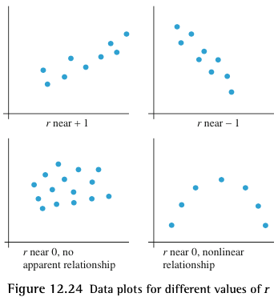

```{r, include=FALSE}
library(knitr)
opts_chunk$set(fig.path='figures_rmd/lec05_', fig.align='center')
```

# Background

Correlation coefficients measure the *linear* relationship between two variables.

* If $y_t = f(x_t)$, correlation in x and y may be observed. This is characterized by what is known as a correlation coefficient.
* However, when the dependency is time-dependent, $y_{t+k} = f(x_t)$, we may wish to examine the correlation lagged by $k$ intervals ($k$=hours in our case).
* Note that people commonly refer to any relationship as correlation, but commonly-used correlation coefficients in statistics measure the degree of a *linear* relationship between two variables. It is important to visualize the data when possible, rather than relying solely on the correlation coefficient, so that nonlinear relationships are not also detected.

## Sample covariance

Sample covariance between variables $x=x_t$ and $y=y_t$:

$$
c_{xy} = \frac{1}{N} \sum_i^N (x_i-\overline{x}) (y_i-\overline{y})
$$

Sample cross-covariance function for positive values of lag between variables $x_t$ and $y_{t+k}$ (Chatfield, *The Analysis of Time Series*, 2004):

$$
c_{xy}(k) = \frac{1}{N} \sum_{t=1}^{N-k} (x_t-\overline{x})(y_{t+k}-\overline{y})
$$

## Sample correlation
  
Pearson's correlation coefficient (sample correlation) is defined as the covariance of two variables divided by the product of their standard deviations (which are the square roots of their respective variances):

$$
r_{xy} = \frac{c_{xy}}{\sqrt{c_{xx}c_{yy}}} %= \frac{\sum (x_i-\overline{x})(y_i-\overline{y})}{\sqrt{ \sum (x_i-\overline{x})^2 \sum (y_i-\overline{y})^2 }}
$$


The sample cross-correlation function:
$$
r_{xy}(k) = \frac{c_{xy}(k)}{\sqrt{c_{xx}(0)c_{yy}(0)}}
$$

  
$c_{xx}$ and $c_{yy}$ are the sample variances of $x$ and $y$, respectively.
\column{.5\textwidth}

$c_{xx}(0)$ and $c_{yy}(0)$ that are the sample variances of $x_t$ and $y_t$ respectively.

## Correlation coefficients illustrated

"For descriptive purposes, the relationship will be described as strong if $|r| \geq .8$, moderate if $.5 < |r| <.8$, and weak if $|r| \leq .5$." -- Devore and Berk, *Modern Mathematical Statistics with Applications*, 2012

<center></center>
  
Anscombe's quartet classically illustrates the pitfalls on relying on a single coefficient --
always visualize your data. Consider the following four datasets:

```{r, echo=FALSE, fig.width=8, fig.height=8}  
  ## from R help ?anscombe
require(datasets); require(stats); require(graphics)

##-- now some "magic" to do the 4 regressions in a loop:
ff <- y ~ x
mods <- setNames(as.list(1:4), paste0("lm", 1:4))
for(i in 1:4) {
  ff[2:3] <- lapply(paste0(c("y","x"), i), as.name)
  ## or   ff[[2]] <- as.name(paste0("y", i))
  ##      ff[[3]] <- as.name(paste0("x", i))
  mods[[i]] <- lmi <- lm(ff, data = anscombe)
  ## print(anova(lmi))
}

op <- par(mfrow = c(2, 2), mar = 0.1+c(3.5,3.5,.5,.5), mgp=c(2,.5,0), oma =  c(0, 0, 2, 0))
for(i in 1:4) {
  ff[2:3] <- lapply(paste0(c("y","x"), i), as.name)
  plot(ff, data = anscombe, col = "red", pch = 21, bg = "orange", cex = 1.2,
       xlim = c(3, 19), ylim = c(3, 13))
  abline(mods[[i]], col = "blue")
}
mtext("Anscombe's 4 Regression data sets", outer = TRUE, cex = 1.5)
par(op)
```

All have similar statistical properties.
```{r, echo=FALSE, message=FALSE}
library(plyr)
library(reshape2)
lf <- melt(transform(anscombe,obs=sequence(nrow(anscombe))),id.var="obs")
lf$var <- substring(lf$variable,1,1)
lf$set <- substring(lf$variable,2,2)
lf$variable <- NULL
##
out <- merge(dcast(melt(rbind(cbind(stat="mean",dcast(lf,set~var,function(x) round(mean(x),2),value.var="value")),
                              cbind(stat="variance",dcast(lf,set~var,function(x) round(var(x),3),value.var="value"))),measure.var=c("x","y"),variable.name="var"),
                   set~stat+var),
             merge(ddply(dcast(lf,set+obs~var),"set",summarise,correlation=round(cor(x,y),2)),
                   ddply(dcast(lf,set+obs~var),"set",function(X)
                         `names<-`(round(coef(lm(y~x,data=X)),2),c("intercept","slope"))),
                   by="set"),
             by="set")
names(out) <- sub("_"," of ",names(out))
````
```{r, echo=FALSE}
kable(out)
```

## Cross (lagged) correlations illustrated
  
Illustration of lag for 20.07.2013 in Lausanne:


* Radiation initiates the photochemistry for ozone formation and is strongly linked to the concentration of atmospheric oxidants.
* Increase in radiation also leads to increase in temperatures, which accelerate rates of reaction.
* The ozone production is not instantaneous, hence the lag.

Could a similar relationship be confirmed by examining correlations between the daily maximum values of radiation and ozone?

## Confounding interpretations
  
  A correlation or lagged correlation in x and y may also be observed. For examples, a correlation between $x$ and $y$ may not be due to the causal relationship between $x$ and $y$, but dependent on a third variable, $z$. This is written:

<table>
<tr>
<td>
<div style="padding: 20px;">
$$
\begin{aligned}
y_t &= f_y(z_t)\\
x_t &= f_x(z_t)
\end{aligned}
$$
</div>
</td>
<td>
<div style="padding: 20px;">
$$
\begin{aligned}
y_{t+k} &= f_y(z_t)\\
x_{t} &= f_x(z_t)
\end{aligned}
$$
</div>
</tr>
</table>

This is why you may often hear the phrase, "*correlation does not imply causation*." 

# R demonstration


```{r, message=FALSE}
library(dplyr)
library(reshape2)
library(chron)
library(ggplot2)
```

```{r}
source("GRB001.R")
```

```{r, results="hide"}
Sys.setlocale("LC_TIME","C")
options(stringsAsFactors=FALSE)
options(chron.year.abb=FALSE)
theme_set(theme_bw()) # just my preference for plots
```

Let us load data saved from Lesson 4.

```{r}
df <- readRDS("data/2013/lau-zue.rds")
variables <- c("O3", "NO2", "CO", "PM10", "SO2", "NMVOC", "EC", "TEMP", "PREC", "RAD")
```

## Pairwise correlations

Let us calculate the daily maximum:
```{r}
lf <- melt(df, measure.vars=variables)
dm <- lf %>% group_by(site, year, month, day, season, variable) %>%
  summarize(value=max(value, na.rm=TRUE))
daily.max <- dcast(dm, site + year + month + day + season ~ variable)
rm(dm) # no longer needed
```

Recall the relationship between temperature and O~3~ shown in a previous lecture. Note the seasonal dependence of this relationship.
```{r, fig.width=10, fig.height=5, warning=FALSE}
ggp <- ggplot(daily.max)+
  facet_grid(site~season)+
    geom_point(aes(TEMP,O3))
print(ggp)
```

We can examine the correlation of other pollutants or meterological variables with O~3~. 
```{r, fig.width=20, fig.height=6, warning=FALSE}
lf <- melt(daily.max, measure.vars=setdiff(variables, "O3")) # everything but ozone
ggp <- ggplot(lf)+
  facet_grid(site~variable, scale="free_x")+
    geom_point(aes(value, O3, group=season, color=season), shape=4)
print(ggp)
```

```{r, fig.width=10, fig.height=5, warning=FALSE}
ggp <- ggplot(df)+
  facet_grid(site~season)+
    geom_point(aes(CO, NO2))
print(ggp)
```

For the following *scatterplot matrix*, we will use a package called `lattice` which is a plotting system that exists in parallel to R's base graphics and `ggplot2` package (confusing, I know). We additionally define a function to include correlation coefficients in our panels.
```{r}
library(lattice)

Correlation.value <- function(x, y, ...) {
  correlation <- cor(x, y,use="pairwise")
  if(!is.na(correlation)) {
    cpl <- current.panel.limits()
    panel.text(mean(cpl$xlim),mean(cpl$ylim),
               bquote(italic(r)==.(sprintf("%.2f",correlation))),
               adj=c(0.5,0.5),col="blue")
  }
}
```


Plot daily maximum values as pairwise points (only Lausanne).
```{r, fig.width=16, fig.height=16}
ix <- grepl("LAU", daily.max[["site"]], fixed=TRUE)
spp <- splom(~daily.max[ix,c("O3","NO2","CO","PM10","TEMP","PREC","RAD")] | daily.max[ix,"season"],
             upper.panel = Correlation.value,
             pch=4)
print(spp)
```

Plot hourly data as pairwise points. Given the large number of points, we can "smooth" the visual representation.
```{r, fig.width=16, fig.height=16, warning=FALSE}
ix <- grepl("LAU", df[["site"]], fixed=TRUE)
spp <- splom(~df[ix,c("O3","NO2","CO","PM10","TEMP","PREC","RAD")] | df[ix,"season"],
             upper.panel = Correlation.value,
             panel = panel.smoothScatter,             
             pch=4)
print(spp)
```


Notice some values of correlation went up.

## Lagged correlations

```{r}
Lag <- function(pair, k) {
  out <- data.frame(k, head(pair[,1],-k), tail(pair[,2],-k))
  names(out) <- c("lag", colnames(pair))
  out
}

lagged <- df %>%
  group_by(site, season) %>%
    do(rbind(Lag(.[,c("RAD","O3")], 1),
             Lag(.[,c("RAD","O3")], 2),
             Lag(.[,c("RAD","O3")], 3),
             Lag(.[,c("RAD","O3")], 4),
             Lag(.[,c("RAD","O3")], 5),
             Lag(.[,c("RAD","O3")], 6)))
```

```{r, message=FALSE, fig.width=12, fig.height=18}
ggp <- ggplot(lagged) +
  geom_point(aes(RAD, O3, group=site, color=site), shape=4)+
    facet_grid(lag~season)
print(ggp)
```

R include a function, `ccf`, for calculating the cross correlation.

```{r}
ccf(df[,"RAD"], df[,"O3"], lag.max=6, na.action=na.pass)
```
This tells us that the correlation is higest at a lag of -3.

We can wrap this in a function that retuns information that we want in a data frame:
```{r}
LaggedCorrelation <- function(pair, ...) {
  out <- ccf(pair[,1], pair[,2], ..., na.action=na.pass, plot=FALSE)
  data.frame(lag=out[["lag"]], value=out[["acf"]])
}

lagged.values <- df %>% group_by(season) %>%
  do(LaggedCorrelation(.[,c("RAD","O3")], lag.max=6))
```
Note the syntax, `...` in the function definition This passes on any additional arguments (`lag.max` in this case) from the outer function (`LaggedCorrelation`) to the inner-most function (`ccf`).

Plot:
```{r, message=FALSE, fig.width=15, fig.height=5}
ggp <- ggplot(lagged.values)+
  geom_segment(aes(x=lag,xend=lag,y=0,yend=value))+
    facet_grid(.~season)+
      xlab("lag (hours)")+
        ylab("Cross correlation coefficient")
print(ggp)
```
