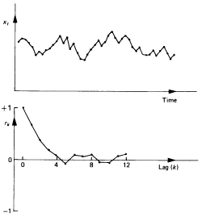
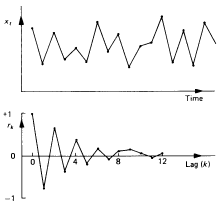
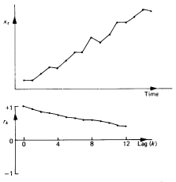
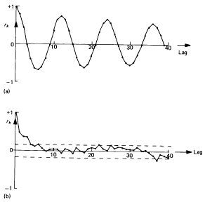
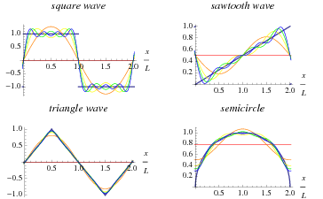
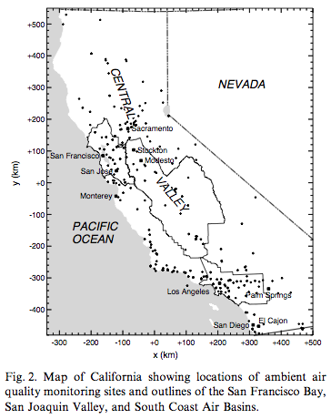
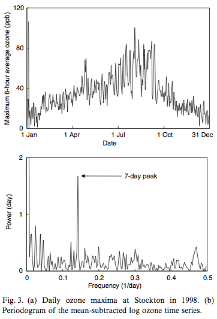

```{r, include=FALSE}
library(knitr)
opts_chunk$set(fig.path='figures_rmd/lec06_', fig.align='center', warning=FALSE, message=FALSE)
```

In this lesson, we will explore how to examine relationships among observations that are made in a sequence (time series).

# Background

## Autocovariance and autocorrelation

Autocovariance for positive values of lag $k$ is defined in a form similar to the cross-covariance:
$$
c_{xx}(k) = \frac{1}{N} \sum_{t=1}^{N-k} (x_t - \overline{x})(x_{t+k} - \overline{x})
$$
Similarly, autocorrelation is:
$$
r_{xx}(k) = \frac{c_{xx}(k)}{c_{xx}(0)}
$$

Autocorrelation coefficients and the correlogram (plot of $r_{xx}(k)$ as a function of lag $k$) can provide insight into the underlying processes [@Chatfield2003].

* *randomness*. low $r_{xx}(k)$ for all $k > 0$.
* *short-term correlations*. rapid drop-off following high $r_{xx}(1)$.
* *non-stationarity* (time series contains a trend). non-zero values of $r_{xx}(k)$ until high value of $k$.
* *periodic fluctuations* (for the duration corresponding to lag $k$). $r_{xx}(k)$ will oscillate with the frequency of the periodic fluctuation.

Example correlelograms (notated as "$r_k$") are shown below. Corresponding time series signals ("$x_r$") are shown directly above for the first three figures. In the last the figure (lower right quadrant), correlelograms are shown for monthly observations in air temperature (top), and short-term correlations remaining after removal of the seasonal contribution to the signal is removed (bottom).

<figure>
<center>
<table>
<tr>
<td>short-term corrlelation</td>
<td>alternating time series</td>
</tr>
<tr>
<td></td>
<td></td>
</tr>
<tr>
<td>non-stationary time series</td>
<td>short-term correlation after removal of seasonal variation</td>
</tr>
<tr>
<td></td>
<td></td>
</tr>
</table>
<figcaption>Figures 2.1--2.4 from @Chatfield2003.</figcaption>
</center>
</figure>
<br>

Such analyses can be used as a basis for constructing a purely statistical models of time series (*ARIMA* models) primarily used for forecasting, but we can also isolate and describe relationships among sequential observations using autocorrelations.

For instance, these representations can be included in discussions of:

* locally emitted pollutants, which might exhibit short-term autocorrelations, or
* pollutants produced by regional photochemistry and/or transported from non-local sources, which might lead to longer-term autocorrelations.

## Power spectrum

We can project a times series (or arbitrary function) onto a basis set consisting of harmonic functions of various frequencies, and determine which coefficients contribute most to the reproduction of the original signal.

<figure>
<center>

<figcaption>From [Wolfram Mathworld](http://mathworld.wolfram.com).</figcaption>
</center>
</figure>
<br>

Next, we will describe the Fourier series transformation of a sequential series of observations (time series) using notation adapted from @Marr2002.

  The original time series $x_t$ can be represented by a Fourier series:
  $$
  x_t = \sum_{k=0}^{N-1} X(k) \exp\left(2\pi i \nu_k t\right)
  $$
where $N$ is the number of observations, and $\nu_k = k/N$. The new series $X(k)$ defined by the discrete Fourier transform are given by:
$$
X(k) = \frac{1}{\sqrt{N}} \sum_{t=0}^{N-1} x_t \exp\left(-2\pi i \nu_k t\right)
$$
for $k=0,1,\ldots,N-1$.  The periodogram or power spectrum is defined as:
$$
P(\nu_k) = |X(k)|^2
$$
and indicates the strength of frequencies in a time series.

The periodogram is a finite Fourier transform of the autocovariance $\{c_{xx}(k)\}$ [@Chatfield2003].

<figure>
<center>
<table>
<tr>
<td></td>
<td></td>
</tr>
</table>
<figcaption>From @Marr2002.</figcaption>
</center>
</figure>
<br>

# R demonstration


```{r}
library(dplyr)
library(reshape2)
library(chron)
library(ggplot2)
```

```{r}
source("GRB001.R")
```

```{r, results="hide"}
Sys.setlocale("LC_TIME","C")
options(stringsAsFactors=FALSE)
options(chron.year.abb=FALSE)
theme_set(theme_bw()) # just my preference for plots
```

```{r}
df <- readRDS("data/2013/lau-zue.rds")
```


```{r}
id.vars <- c("site", "datetime", "year", "month", "day", "hour", "season", "dayofwk", "daytype")

lf <- melt(filter(df, site=="ZUE"), id.vars=id.vars)
```

<!-- ```{r} -->
<!-- DropVariables <- function(x) { -->
<!--   DropIfEmpty <- function(x) -->
<!--     if(all(is.na(x[["value"]]))) { -->
<!--       data.frame() -->
<!--     } else { -->
<!--       x -->
<!--     } -->
<!--   x %>% group_by(variable) %>% -->
<!--     do(DropIfEmpty(.)) -->
<!-- } -->

<!-- lf <- DropVariables(lf) -->
<!-- ``` -->

## Autocorrelation

We will first visualize the effect of imposing a lag on a variable. We can apply lags to each variable (each time series is segmented by season) with the following code:

```{r}
SelfLag <- function(x, k) {
  data.frame(lag=k, x0=head(x,-k), xk=tail(x,-k))
}

lagged <- lf %>% group_by(site, season, variable) %>%
  do(rbind(SelfLag(.[["value"]], 1),
           SelfLag(.[["value"]], 3),
           SelfLag(.[["value"]], 5),
           SelfLag(.[["value"]], 7)))
```

We will plot the effect of the lag (shown across rows) on two meteorological variables: radiation and temperature.

```{r, fig.width=7, fig.height=7}
ggp <- ggplot(filter(lagged, variable=="RAD"))+
  geom_abline(intercept=0, slope=1)+  
    geom_point(aes(x0, xk), shape=3, color="gray")+
      facet_grid(lag~season)+
        labs(x=expression(x(t[0])), y=expression(x(t[k])))
print(ggp)
```

```{r, fig.width=7, fig.height=7}
ggp <- ggplot(filter(lagged, variable=="TEMP"))+
  geom_abline(intercept=0, slope=1)+  
    geom_point(aes(x0, xk), shape=3, color="gray")+
      facet_grid(lag~season)+
        labs(x=expression(x(t[0])), y=expression(x(t[k])))
print(ggp)
```

We will calculate the autocorrelation coefficient for up to a lag of 6 intervals (hours in our case).

```{r}
Autocorrelation <- function(x, ...) {
  with(acf(x, ..., na.action=na.pass, plot=FALSE),
       data.frame(lag, acf))
}

autocorr <- lf %>% group_by(site, season, variable) %>%
  do(Autocorrelation(.[["value"]], lag.max=6))
```

We can view the correlelograms for all variables:

```{r, fig.width=7, fig.height=9}
ggp <- ggplot(autocorr)+
  geom_hline(yintercept=0)+        
    geom_point(aes(lag, acf))+
      geom_segment(aes(lag, 0, xend=lag, yend=acf))+
        facet_grid(variable~season)+
          labs(x="lag", y="acf")
print(ggp)
```

## Power spectrum

R has a built-in function, `spectrum`, to calculate the power spectrum. For illustration, we will apply it to hourly time series from July.

```{r, error=TRUE}
ix <- df[["month"]]=="Jul"
spec <- spectrum(df[ix,"CO"])
```

We see that there is an error on account of missing values. There is a class of statistical  techniques called "imputation" for replacing missing values, but in our case we will simply use linear interpolation. This is accomplished using the `approx` function built into R.

```{r}
out <- approx(df[ix,"datetime"], df[ix,"CO"], df[ix,"datetime"])
str(out)
```
The list element `y` contains the interpolated values, and now we can calculate the spectrum, which also provides us with the plot.

```{r, spec.plot}
spec <- spectrum(out[["y"]])
```

We can add frequencies which correspond to periods of 4, 6, 8, ... hours. This is using the *base graphics* plotting functionality (in contrast to ggplot) in R:

```{r, echo=-1}
<<spec.plot>>
hrs <- c("4-hr"=4, "6-hr"=6, "8-hr"=8, "12-hr"=12, "daily"=24, "weekly"=24*7, "monthly"=24*30)
abline(v=1/hrs, col=seq(hrs)+1, lty=2)
legend("topright", names(hrs), col=seq(hrs)+1, lty=2, bg="white")
```

Next, we want to generalize over all seasons and variables:

```{r}
Spectr <- function(x, y) {
  out <- approx(x, y, xout=x)
  spec <- spectrum(out[["y"]], plot=FALSE)
  data.frame(spec[c("freq", "spec")])
}

spec <- lf %>% group_by(site, season, variable) %>%
  do(Spectr(.[["datetime"]],.[["value"]]))
```

We can similarly produce a power spectrum:

```{r, fig.width=8, fig.height=8}
period <- data.frame(label=factor(names(hrs), names(hrs)), freq=1/hrs)

ggp <- ggplot(spec)+
  geom_vline(aes(xintercept=freq, color=label), data=period, linetype=2)+  
    geom_line(aes(freq, spec))+
      facet_grid(variable~season, scale="free_y")+
        scale_y_log10()
print(ggp)
```

We can also calculate daily averages and apply the spectra decomposition:

```{r}
daily <- lf %>% mutate(date=dates(datetime)) %>%
  group_by(site, variable, season, date) %>%
    summarize(value=mean(value, na.rm=TRUE))

spec.daily <- daily %>% group_by(site, season, variable) %>%
  do(Spectr(.[["date"]],.[["value"]]))

period.daily <- data.frame(label=c("weekly", "monthly"),
                           freq =1/c(7, 30))
```

Plot results for daily power spectra:

```{r, fig.width=7, fig.height=7}
ggp <- ggplot(spec.daily)+
  geom_vline(aes(xintercept=freq, color=label), data=period.daily, linetype=2)+  
    geom_line(aes(freq, spec))+
      facet_grid(variable~season, scale="free_y")
print(ggp)
```

