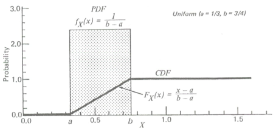
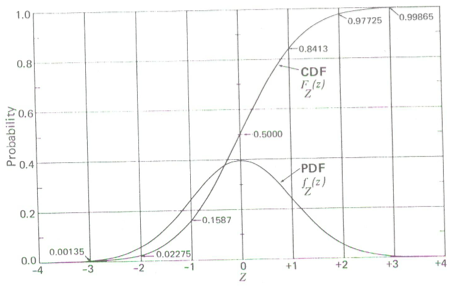
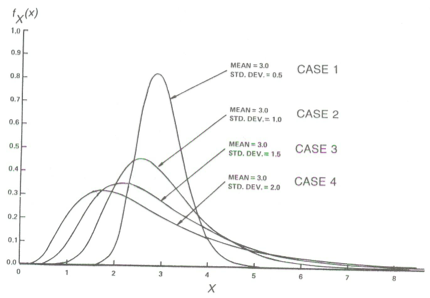

```{r, include=FALSE}
library(knitr)
opts_chunk$set(fig.path='figures_rmd/lec07_', fig.align='center', warning=FALSE, message=FALSE)
```

\newcommand{\E}{\operatorname{E}}
\newcommand{\Var}{\operatorname{Var}}
\newcommand{\erf}{\operatorname{erf}}

# Background

## The probability model

@Ott1994

A *stochastic process* is a process which includes or comprises random components. We describe the outcome of such processes with *random variables*, which can take on a range of values.
A \emph{probability model} is a set of rules describing the probabilities of all possible outcomes in the sample space. The values generated by such models are called *probability distributions*. We will discuss probability distributions for continuous random variables (environmental concentrations). 

For a random variable $X$, we can describe probability ranges/distributions by the continuous distribution function (CDF) $F_X$ and probability distribution function (PDF) $f_X$:
$$
\begin{aligned}
F_X(x) &= P(X \leq x) = \int_{-\infty}^x f_X(u)du\\
f_X(x) &= \frac{dP}{dx} = \lim_{\Delta x \to 0} \frac{P(x < X \leq x + \Delta x)}{\Delta x} = \frac{d}{dx} F_X(x)
\end{aligned}
$$
Any physical observation we make can be considered as "sampling" from this distribution. 
The actual value that we observe will depend on a large number of stochastic processes, but the likelihood of drawing a particular value will follow $f_x(x)$.

## Characterizing random variables with probability distributions, expected value, and variance

In this and future modules, we will introduce nonparameteric and three parameteric distributions: uniform, normal, and lognormal distributions.

In addition, we will discuss two main properties of random variables.

* The expected value (also: average or arithmetic mean) of a random variable $\E(X)$ is a measure of the central tendency. 
* The variance $\Var(X)$ is the second moment about the mean, $\E\{[X-\E(X)]^2\} = \E(X^2)-\E(X)^2$.

When we describe the probability model of a random variable $X$ with a parameteric distribution, we can express $\E(X)$ and $\Var(X)$ as a function of distribution parameters. The sample mean, $\bar{X}$, is also a random variable.

## Parametric distributions

### Uniform distribution

Random variable $X$ can take on any value between $a$ and $b$ with equal probability.

For $x \in [a,b]$, the PDF and CDF are
$$
\begin{aligned}
f_X(x) &= \frac{1}{b-a}\\
F_X(x) &= \frac{x-a}{b-a}
\end{aligned}
$$

\bigskip
Mean and variance:
$$
\begin{aligned}
\E(X) &= \frac{a+b}{2}\\
\Var(X) &= \frac{(b-a)^2}{12}
\end{aligned}
$$

<figure>
<center>

<figcaption>Figure 3.4 from @Ott1994</figcaption>
</center>
</figure>
<br>

## Normal distribution


PDF and CDF:
$$
\begin{aligned}
f_X(x) &= \frac{1}{\sigma\sqrt{2\pi}} \exp\left(-\frac{(x-\mu)^2}{2\sigma^2}\right)\\
F_X(x) &= \frac{1}{2} \left[ \erf\left(\frac{x-\mu}{\sigma\sqrt{2}}\right)+1\right]
\end{aligned}
$$
The following ratio is also called the normal standard variable; often designated as $z$:
\[
z = \frac{x-\mu}{\sigma}
\]
The value of $z$ is also called the $z$-score.

\bigskip
Mean and variance:
$$
\begin{aligned}
\E(X) &= \mu \\
\Var(X) &= \sigma^2 
\end{aligned}
$$

<figure>
<center>
<div id="div2">

</div>
<figcaption>Figure 7.1 from @Ott1994</figcaption>
</center>
</figure>
<br>

## Lognormal distribution

PDF and CDF:
$$
\begin{aligned}
f_X(x) &= \frac{1}{x\sigma \sqrt{2\pi}} \exp\left[-\frac{(\ln x- \mu)^2}{2\sigma^2}\right]\\
F_X(x)  &= \frac{1}{2}\left[1+\erf\left(\frac{\ln x-\mu}{\sigma\sqrt{2}}\right)\right]
\end{aligned}
$$
Note that the expected value and variance of $X$ are not the same $\mu$ and $\sigma^2$ as for the normal distribution.
$$
\begin{aligned}
\E(X) &= e^{\mu + \sigma^2/2}\\
\Var(X) &= e^{2\mu+\sigma^2}\left(e^{\sigma^2} - 1\right)
\end{aligned}
$$


<figure>
<center>

<figcaption>Figure 9.2 from @Ott1994</figcaption>
</center>
</figure>
<br>


## Non-(globally)parameteric estimates of the PDF and CDF for a set of observations

(Empirical distributions)

For exploratory analysis, it is useful to visualize $F_X(x)$ and $f_X(x)$ that do not assume any fixed probability distributions a priori.

**Empiricial CDF**. We can estimate the CDF by number of elements in sample set less than or equal to a value $x$ divided by the number of elements in the sample set:
\[
\hat{F}_X(x) = \frac{1}{n} \Big{|}\{x_i \leq x \, : \, i=1,2,\ldots,n\}\Big{|}
\]
where $|\cdot |$ is the cardinality of (number of elements in) a set.

<figure>
<center>

<figcaption>Figure 5.5 from @Venables2003</figcaption>
</center>
</figure>
<br>

**PDF**. A histogram normalized to probability rather than counts is an estimator of the density function. However, the histogram depends on the starting point of the grid of bins. Shown below are five histograms (of Old Faithful geyser duration data) with grid bins shifted (fixed width of 0.5) and the frequency polygon of their average:

<figure>
<center>

<figcaption>Figure 5.8 from @Venables2003</figcaption>
</center>
</figure>
<br>

We can alternately view the \emph{kernel density estimate} with bandwidth $b$,
\[
\hat{f}_X(x) = \frac{1}{nb} \sum_{j=1}^n K\left(\frac{x-x_j}{b}\right)
\]
The fixed kernel $K$ is normally chosen to be a probability density function (PDF). For instance, for a normal (Gaussian) distribution is
\[
K(u) = \frac{1}{\sqrt{2\pi}} \exp\left(-\frac{1}{2} u^2\right)
\]
<!-- http://en.wikipedia.org/wiki/Kernel_%28statistics%29 -->
Shown below are the same Old Faithful duration histograms superimposed by density estimates using a Gaussian kernel and several different bandwidths.

<figure>
<center>

<figcaption>Figure 5.9 from @Venables2003</figcaption>
</center>
</figure>
<br>

Note that the form of $K$ is not related to the actual distribution of $X$. Alternative kernels include rectangular, triangular, cosine, etc. For instance, the cosine kernel would be $K(u) = (1+\cos \pi u)/2$ over [-1,1].

