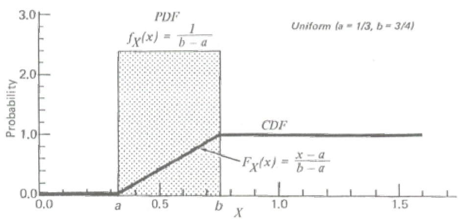
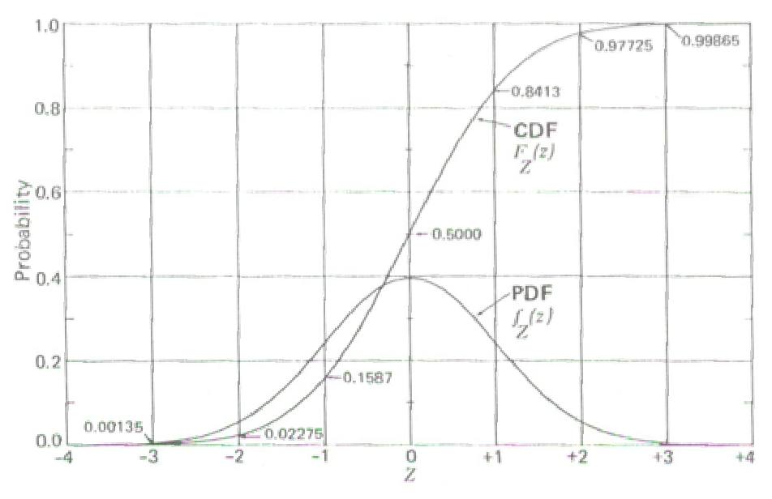
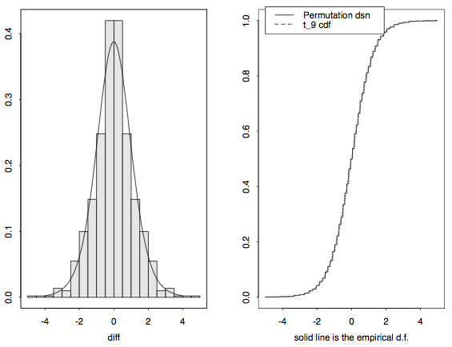
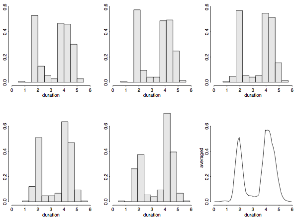
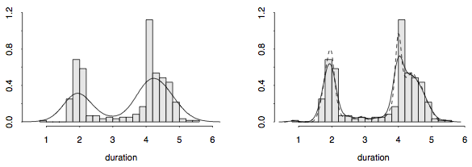

```{r, include=FALSE}
library(knitr)
opts_chunk$set(fig.path='figures_rmd/lec07_', fig.align='center', warning=FALSE, message=FALSE)
```

\newcommand{\E}{\operatorname{E}}
\newcommand{\Var}{\operatorname{Var}}
\newcommand{\erf}{\operatorname{erf}}

# Background

## The probability model

@Ott1994

A *stochastic process* is a process which includes or comprises random components. We describe the outcome of such processes with *random variables*, which can take on a range of values.
A \emph{probability model} is a set of rules describing the probabilities of all possible outcomes in the sample space. The values generated by such models are called *probability distributions*. We will discuss probability distributions for continuous random variables (environmental concentrations). 

For a random variable $X$, we can describe probability ranges/distributions by the continuous distribution function (CDF) $F_X$ and probability distribution function (PDF) $f_X$:
$$
\begin{aligned}
F_X(x) &= P(X \leq x) = \int_{-\infty}^x f_X(u)du\\
f_X(x) &= \frac{dP}{dx} = \lim_{\Delta x \to 0} \frac{P(x < X \leq x + \Delta x)}{\Delta x} = \frac{d}{dx} F_X(x)
\end{aligned}
$$
Any physical observation we make can be considered as "sampling" from this distribution. 
The actual value that we observe will depend on a large number of stochastic processes, but the likelihood of drawing a particular value will follow $f_x(x)$.

Appearance of randomness can arise from 

* *variability*: natural variations
* *uncertainty*: "incomplete scientific or technical knowledge" (Morgan 1990), or our lack of capability for accurate/precise observation. (our ignorance regarding functional dependences among variables may lead to the appearance of randomness)
\end{itemize}


## Characterizing random variables with probability distributions, expected value, and variance

In this lesson, we will introduce nonparameteric and three parameteric distributions: uniform, normal, and lognormal distributions. 

In addition, we will discuss two main properties of random variables.

* The expected value (also: average or arithmetic mean) of a random variable $\E(X)$ is a measure of the central tendency. 
* The variance $\Var(X)$ is the second moment about the mean, $\E\{[X-\E(X)]^2\} = \E(X^2)-\E(X)^2$.

When we describe the probability model of a random variable $X$ with a parameteric distribution, we can express $\E(X)$ and $\Var(X)$ as a function of distribution parameters. The sample mean, $\bar{X}$, is also a random variable.

## Parametric distributions

### Uniform distribution

Random variable $X$ can take on any value between $a$ and $b$ with equal probability.

For $x \in [a,b]$, the PDF and CDF are
$$
\begin{aligned}
f_X(x) &= \frac{1}{b-a}\\
F_X(x) &= \frac{x-a}{b-a}
\end{aligned}
$$

\bigskip
Mean and variance:
$$
\begin{aligned}
\E(X) &= \frac{a+b}{2}\\
\Var(X) &= \frac{(b-a)^2}{12}
\end{aligned}
$$

<figure>
<center>

<figcaption>Figure 3.4 from @Ott1994</figcaption>
</center>
</figure>
<br>

### Normal distribution


PDF and CDF:
$$
\begin{aligned}
f_X(x) &= \frac{1}{\sigma\sqrt{2\pi}} \exp\left(-\frac{(x-\mu)^2}{2\sigma^2}\right)\\
F_X(x) &= \frac{1}{2} \left[ \erf\left(\frac{x-\mu}{\sigma\sqrt{2}}\right)+1\right]
\end{aligned}
$$
The following ratio is also called the normal standard variable; often designated as $z$:
\[
z = \frac{x-\mu}{\sigma}
\]
The value of $z$ is also called the $z$-score.

\bigskip
Mean and variance:
$$
\begin{aligned}
\E(X) &= \mu \\
\Var(X) &= \sigma^2 
\end{aligned}
$$

<figure>
<center>
<div id="div2">

</div>
<figcaption>Figure 7.1 from @Ott1994</figcaption>
</center>
</figure>
<br>

### Lognormal distribution

PDF and CDF:
$$
\begin{aligned}
f_X(x) &= \frac{1}{x\sigma \sqrt{2\pi}} \exp\left[-\frac{(\ln x- \mu)^2}{2\sigma^2}\right]\\
F_X(x)  &= \frac{1}{2}\left[1+\erf\left(\frac{\ln x-\mu}{\sigma\sqrt{2}}\right)\right]
\end{aligned}
$$
Note that the expected value and variance of $X$ are not the same $\mu$ and $\sigma^2$ as for the normal distribution.
$$
\begin{aligned}
\E(X) &= e^{\mu + \sigma^2/2}\\
\Var(X) &= e^{2\mu+\sigma^2}\left(e^{\sigma^2} - 1\right)
\end{aligned}
$$


<figure>
<center>

<figcaption>Figure 9.2 from @Ott1994</figcaption>
</center>
</figure>
<br>


## Non-(globally)parameteric estimates of the PDF and CDF for a set of observations

For exploratory analysis, it is useful to visualize $F_X(x)$ and $f_X(x)$ that do not assume any fixed probability distributions a priori (empirical distributions).

**Empiricial CDF**. We can estimate the CDF by number of elements in sample set less than or equal to a value $x$ divided by the number of elements in the sample set:
\[
\hat{F}_X(x) = \frac{1}{n} \Big{|}\{x_i \leq x \, : \, i=1,2,\ldots,n\}\Big{|}
\]
where $|\cdot |$ is the cardinality of (number of elements in) a set.

<figure>
<center>

<figcaption>Figure 5.5 from @Venables2003</figcaption>
</center>
</figure>
<br>

**PDF**. A histogram normalized to probability rather than counts is an estimator of the density function. However, the histogram depends on the starting point of the grid of bins. Shown below are five histograms (of Old Faithful geyser duration data) with grid bins shifted (fixed width of 0.5) and the frequency polygon of their average:

<figure>
<center>

<figcaption>Figure 5.8 from @Venables2003</figcaption>
</center>
</figure>
<br>

We can alternately view the \emph{kernel density estimate} with bandwidth $b$,
\[
\hat{f}_X(x) = \frac{1}{nb} \sum_{j=1}^n K\left(\frac{x-x_j}{b}\right)
\]
The fixed kernel $K$ is normally chosen to be a probability density function (PDF). For instance, for a normal (Gaussian) distribution is
\[
K(u) = \frac{1}{\sqrt{2\pi}} \exp\left(-\frac{1}{2} u^2\right)
\]
<!-- http://en.wikipedia.org/wiki/Kernel_%28statistics%29 -->
Shown below are the same Old Faithful duration histograms superimposed by density estimates using a Gaussian kernel and several different bandwidths.

<figure>
<center>

<figcaption>Figure 5.9 from @Venables2003</figcaption>
</center>
</figure>
<br>

Note that the form of $K$ is not related to the actual distribution of $X$. Alternative kernels include rectangular, triangular, cosine, etc. For instance, the cosine kernel would be $K(u) = (1+\cos \pi u)/2$ over [-1,1].

## Types of statistics

We distinguish among three types of statistics:

* *Descriptive statistics*: Provide characterization of your random variables with meaningful metrics that simplify their representation.
* *Inferential statistics*: Determine underlying mechanisms that generated the data, or draw conclusions regarding the value of metrics or estimates observed given the variability in the data.
* *Predictive statistics*: Descriptive statistics of current or local data are often used to make forecasts in future scenarios.

Probability distributions can be used to describe natural variability and uncertainties in our measurement or knowledge:

* Probability distribution can be used to describe *natural variability* of pollutant (e.g., NO<sub>2</sub>) concentrations (due to mechanistic reasons). We can obtain more restrictive probability distributions by identifying the underlying factors and creating a number of probability distributions, each of which applies to a set of specific conditions.
* In many circumstances, we can describe probability distributions with a parameteric distribution (i.e., an analytical function with a fixed set of parameters). E.g., *a lognormal distribution*.
* We can imagine that there are *uncertainties* regarding our knowledge of the exact probability distribution of pollutant (e.g., NO<sub>2</sub>). If we describe this distribution in parameteric form, then we can understand one aspect of the uncertainties in distribution through studying the uncertainties in the parameters of this distribution.
* Uncertainty regarding a parameter can also be characterized with a probability distribution of the estimator for that parameter.

As described above, characteristics most commonly used statistics to describe distributions of random variable are:

* expected value, written as $\E(X)$ or $\mu_X$
* variance, written as $\Var(X)$ or $\sigma_X^2$

For a normal distribution, $\mu\pm\sigma$ encompasses 68.2\%, $\mu\pm 2\sigma$ encompasses 95.5\%, $\mu\pm 2\sigma$ encompasses 99.7\%, and so on. We can also consider their geometric corollaries, which are appropriate for lognormally distributed variables: geometric mean ($\mu_{\log(X)}$) and geometric standard deviation ($\sigma_{\log(X)}$).

The mean and variance are examples of the possible \emph{moments} of a distribution $f(x)$, which include skewness (3rd order), kurtosis (4th order), and so on.
$$
M_n(X) = \int_{-\infty}^\infty (x-c)^n f(x) dx
$$
Higher order moments ($n > 2$) are not commonly used in practice.

We can also compute *order statistics*, which do not assume any parameteric form $f_\theta(x)$ of the underlying distribution.

* median
* quartiles and interquartile-range (IQR)
* quantiles (e.g., 5th to 95th percentile)
* range

These metrics more generally describe the *central tendencies* and *dispersion* in the distribution. The difference between the mean and median may provide indication regarding the symmetry of the distribution.


# R Demonstration

```{r}
library(dplyr)
library(reshape2)
library(chron)
library(ggplot2)
```

```{r}
source("GRB001.R")
```

```{r}
Sys.setlocale("LC_TIME","C")
options(stringsAsFactors=FALSE)
options(chron.year.abb=FALSE)
theme_set(theme_bw())
```

```{r}
df <- readRDS("data/2013/lau-zue.rds")
lau <- df %>% filter(site=="LAU")
```

## Ozone in Lausanne (probability/kernel density)

The annual probability density appears to be multimodal, but we can see that this is due to the strong variation in seasonal probability distributions of ozone concentrations.

```{r}
ggp <- ggplot(lau)+
  geom_line(aes(x=O3, ymax=..density..),
            stat="density", position="identity")+
              xlab(expression("O3 concentration"~(mu*g/m^3)))
print(ggp)
```

```{r}
ggp <- ggplot(lau)+
  geom_line(aes(x=O3, ymax=..density.., group=month, color=month),
            stat="density",
            position="identity")+
              xlab(expression("O3 concentration"~(mu*g/m^3)))
print(ggp)
```


## Ozone in Lausanne (ECDF)
  
We can also view the empirical CDFs (ECDF) of hourly concentrations for 2013. ECDFs can be computed with R in (see `?ecdf`), but can be applied during the call to `ggplot`.

```{r}
ggp <- ggplot(lau)+
  geom_line(aes(x=O3), stat="ecdf")+
    xlab(expression("O3 concentration"~(mu*g/m^3)))+
      ylab("Probability")
print(ggp)
```

We can also segregate the ECDFs by month; for ozone there is a particularly strong variation.

```{r}
ggp <- ggplot(lau)+
  geom_line(aes(x=O3, group=month, color=month),
            stat="ecdf", position="identity")+
  xlab(expression("O3 concentration"~(mu*g/m^3)))+  
  ylab("Probability")
```

## All pollutants in Lausanne and Zurich

First, we must convert our data frame to the elongated format.

```{r}
id.vars <- c("datetime", "season", "month", "site")
pollutants <- c("O3", "NO2", "CO", "PM10", "SO2", "NMVOC", "EC")
lf <- melt(df[, c(id.vars, pollutants)], id.vars=id.vars)

```

```{r, fig.width=10, fig.height=3.5}
ggp <- ggplot(lf)+
  geom_line(aes(x=value, group=month, color=month),
            stat="ecdf", position="identity")+
              facet_grid(site~variable,scale="free_x")+
                xlab("Value")+  
                  ylab("Probability")
print(ggp)
```

## Descriptive statistics

Define some functions: 
```{r}
Geomean <- function(x, na.rm = FALSE, trim = 0, ...) {
  ## Geometric mean
  exp(mean(log(x, ...), na.rm = na.rm, trim = trim, ...))
}

Geosd <- function(x, na.rm = FALSE, ...) {
  ## Geometric standard deviation  
  exp(sd(log(x, ...), na.rm = na.rm, ...))
}

ComputeCentral <- function(x) {
  ## x is a vector of values
  stats <- c("mean"    = mean(x,na.rm=TRUE),
             "median"  = median(x,na.rm=TRUE),
             "geomean" = Geomean(x,na.rm=TRUE))
  data.frame(stat=factor(names(stats), names(stats)), value=stats)
}

ComputeDispersion <- function(x) {
  ## x is a vector of values
  stats <- c("sd"    = sd(x,na.rm=TRUE),
             "IQR"   = IQR(x,na.rm=TRUE),
             "geosd" = Geosd(x,na.rm=TRUE))
  data.frame(stat=factor(names(stats), names(stats)), value=stats)
}
```

Compare central values:
```{r}
stats.central <- lf %>% filter(site=="LAU" & !is.na(value)) %>%
  group_by(season, variable) %>%
  do(ComputeCentral(.[["value"]]))

```
```{r, fig.width=10, fig.height=5}
ggp <- ggplot(stats.central)+
  geom_bar(aes(stat, value),
           stat="identity",
           fill="gray")+
             facet_grid(variable~season,scale="free_y")
print(ggp)
```
Why are geomean values missing?

Compare dispersion metrics:
```{r}
stats.disp <- lf %>% filter(site=="LAU" & !is.na(value)) %>%
  group_by(season, variable) %>%
  do(ComputeDispersion(.[["value"]]))
```

```{r, fig.width=10, fig.height=5}
ggp <- ggplot(stats.disp)+
  geom_bar(aes(stat, value),
           stat="identity",
           fill="gray")+
             facet_grid(variable~season,scale="free_y")
print(ggp)
```
Why are geosd values missing?

# References
