```{r, include=FALSE}
library(knitr)
opts_chunk$set(fig.path='figures_rmd/lec08_', fig.align='center', warning=FALSE, message=FALSE)
```

\newcommand{\E}{\operatorname{E}}
\newcommand{\Var}{\operatorname{Var}}
\newcommand{\erf}{\operatorname{erf}}

# Background

In this lesson:

* How do we compare two sets of concentrations? Are weekend concentrations higher than weekday? Are concentrations in Zurich higher than Lausanne? There are many ways to answer these questions. We will discuss how to compare average values and declare whether they might be different, given the distribution of concentrations in the measurements.
* Can our data tell us something about the dominant atmospheric process responsible for the observed concentrations of a pollutant? What might that say about the nature of the source of the pollutant? We will evaluate whether dispersion might be a dominant source.

To answer these questions, we turn to inferential statistics. We will pose a hypothesis, and let the data tell us whether it may be true or not.

## Inferential statistics

The objective of inferential statistics is to determine underlying mechanisms that generated the data, or draw conclusions regarding the value of metrics or estimates observed given the variability in the data.

Topics:

* Normal processes and the central limit theorem
* Lognormal processes and environmental dispersion
* Hypothesis testing framework
* Sampling distribution of the mean
* Testing differences in means
* Fitting probability distributions
* Considerations for extension to other tests

## Physical processes

Two special processes lead to statistical distributions we presented in an earlier lesson.

### Normal processes

*A normal [or Gaussian] process results when a number of unrelated, continuous random variable are added together*. [@Ott1994]


Particles suspended in a fluid are continuously bombarded by the surrounding fluid molecules $\Rightarrow$ results in a random, irregular motion ("random walk") of the particles known as Brownian motion. [@Hinds1999]

<center>
<figure>
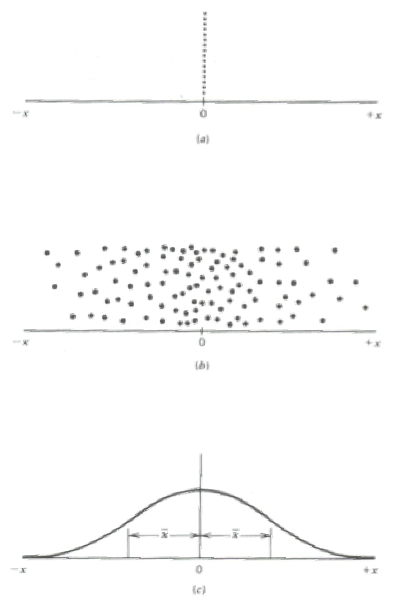
</figure>
<figcaption>
<!-- <div align="right">Figure 7.6 from @Hinds1999</div> -->
Figure 7.6 from @Hinds1999.
</figcaption>
</center>
<br>

The spread of particles with time can be determined by solving the one-dimensional equation of diffusion (Fick's second law) for $n(x=0,t=0) = n_0$,
$$
\frac{\partial n}{\partial t} = D \frac{\partial^2n}{\partial x^2}
$$
The solution for the concentration distribution is given by the Gaussian form,
$$
n(x,t) = \frac{n_0}{2\sqrt{\pi Dt}}\exp\left(\frac{-x^2}{4Dt}\right)
$$

The mean square displacement of particles of the particles from $x=0$ at time $t$ is given by
$$
\langle{x^2}\rangle = \frac{1}{n_0} \int_{-\infty}^\infty x^2 n(x,t) dx = 2 Dt
$$
<!-- Note that this quantiy can also be computed from the force balance covered in a previous lecture, -->
<!-- $$ -->
<!-- m\frac{d\mathbf{v}}{dt} = \mathbf{F}_{\text{drag}} + \mathbf{F}_{\text{Brownian}} -->
<!-- $$ -->

The fractional distribution of particles can be expressed as a function of position $x$ at time $t$,
$$
f(x,t) = \frac{n(x,t)}{n_0} = \frac{1}{\sqrt{2\pi\langle{x^2}\rangle}} \exp\left(-\frac{x^2}{2\langle{x^2}\rangle}\right)
$$

Other normal processes

* Analytical measurement errors
* Mean estimation

This leads to the normal distribution that we discussed in our previous lesson:

<center>
<figure>

</figure>
<figcaption>
Figure 7.1 from @Ott1994.
</figcaption>
</center>


### Lognormal processes


*A lognormal process is one in which the random variable of interest results from the product of many independent random variables multiplied together* [@Ott1994]

* The variable of interest can be expressed as a linear proportion of the value it attains in each previous state. The values of the linear proportions are bounded---if any proportion is zero, the product generated by this process will be zero regardless of the values of subsequent proportions.
* Each linear proportion is assumed to be independent of all successive linear
 proportions
* Many successive states have occurred between initial state and point in time in which the variable is observed.

**Theory of successive dilutions** [@Ott1990]:

$c_0$ is the initial concentration, $D_m$ is the $m$th dilution factor, and $C_m$ is **the concentration in $m$th cell** (increasing dilution with increasing $m$).
$$
\begin{aligned}
C_1 &= c_0 D_1 \\
C_2 &= C_1 D_2 = c_0 D_1 D_2 \\
C_m &= c_0 D_1 D_2 \ldots D_m = c_0 \prod_{i=1}^m D_i \\
\log C_m &= \log c_0 + \log D_1 + \log D_2 + \ldots + \log D_m = c_0 \sum_{i=1}^m \log D_i
\end{aligned}
$$
If $D_i$ is a random variable (e.g., uniformly distributed), r.h.s. of last equation is sum of $m$ independent random variables $\Rightarrow$ $\log C_m$ normally distributed $\Rightarrow$ $C_m$, the concentration at point of observation, \textbf{is lognormally distributed}.

<center>
<figure>
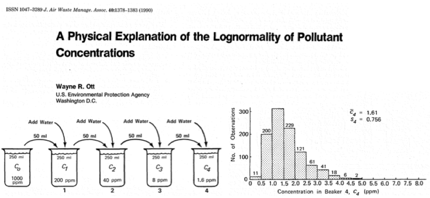
</figure>
<figcaption>
Figure 1 from @Ott1990.
</figcaption>
</center>
<br>

This leads to the lognormal distribution that we discussed in our previous lesson:

<center>
<figure>

</figure>
<figcaption>
Figure 9.2 from @Ott1994.
</figcaption>
</center>

## Hypothesis testing framework

In this lesson, we will use this knowledge to

* Derive confidence intervals for the mean value (normal distribution). *Question*: is the mean different from another value (e.g., another computed mean)?
* Test whether dilution is a dominant mechanism leading to concentrations of each pollutant in the atmosphere. *Question*: is the distribution lognormally distributed?

To answer these questions, we turn to a hypothesis testing framework.

Hypothesis testing is a method of statistical inference by which we determine whether a proposed statement is favored over another. We designate these statements as either the null hypothesis $H_0$ or the alternative hypothesis $H_a$. The selection and application of statistical tests can lead to several types of errors.

<center>
<table cellpadding="10">
<tr style="padding-left:5px;padding-right:5px;border-bottom: 1px solid #000;">
<th> Decision </th><th> $H_0$ True </th><th> $H_a$ </th>
</tr>
<tr style="border-bottom: 1px solid #000;">
<td align="center" style="padding-left:5px;padding-right:5px;"> reject $H_0$ </td>
<td align="center" style="padding-left:5px;padding-right:5px;"> *Type I error* ($\alpha$) </td>
<td align="center" style="padding-left:5px;padding-right:5px;"> Correct decision  </td>
<tr style="border-bottom: 1px solid #000;">
<td align="center" style="padding-left:5px;padding-right:5px;"> do not reject $H_0$ </td>
<td align="center" style="padding-left:5px;padding-right:5px;"> Correct decision </td>
<td align="center" style="padding-left:5px;padding-right:5px;"> *Type II error*  ($\beta$) </td>
</tr>
</table>
</center>
<br>

* *Type I error*: rejecting null hypothesis when it is true.
* *Type II error*: failing to reject the null hypothesis when the alternative hypothesis is true.

## Sampling distribution of the mean

**Random variables**

Let $X$ represent the concentration of an atmospheric pollutant. In the statistical view,

* $X$ is a random variable and has a probability distribution.
* Any physical observation we make can be considered as "sampling" from this distribution.
* The actual value that we observe will depend on a large number of stochastic processes, but the likelihood of drawing a particular value will follow a probability distribution prescribed by $X$.

The sample mean, $\bar{X}$, is an *estimator* of the mean of $X$, $\mu_X$, and *also has a probability distribution*.

* The sample mean is calculated from a limited number ($n$) of samples/values (randomly) drawn from the population of $X$.
* Estimates of the mean will exhibit variation, depending on which $n$ values are selected. Environmental sampling or measurement can be thought of as a single realization of sample selection (in most applications) $\to$ we do not have many estimates of the mean, but one value calculated from a single set of $n$ samples.
* This leads to uncertainty in our knowledge regarding the true mean of $X$.

We define the expected value and variance for each distribution with the following symbols:

<center>
<table>
<tr>
<td>
$$
\begin{aligned}
\mu_X &= \E(X)\\
\sigma_X^2 &= \Var(X)
\end{aligned}
$$
</td><td>
$$
\begin{aligned}
\mu_{\bar{X}} &= \E(\bar{X})\\
\sigma_{\bar{X}}^2 &= \Var(\bar{X})
\end{aligned}
$$
</td>
</tr>
</table>
</center>

* Based on our *point estimate* of the mean, $\bar{x}$, we wish to make a statement regarding what $\mu_X$ might be. ($\bar{x}$ is a single value calculated from $n$ sampled points.)
* We formulate a proposed statement as an alternative hypothesis to be compared against a null hypothesis.
* The null hypothesis may be selected to be the complement of the alternative hypothesis, or may be selected based on convention.

Hypothesis:
$$
\begin{array}{l}
H_0: \mu_{X} = \mu_0\\
H_a: \mu_{X} \neq \mu_0
\end{array}
$$
The estimator by which we evalute this hypothesis is the sample mean:
$$
\bar{X} = \frac{X_1 + X_2 + \ldots + X_n}{n}
$$

## Testing difference in means

### Example distribution

Example: let $X$ be uniformly distributed between $[a,b]$ where $a=0$ and $b=1$.

<center>
<figure>
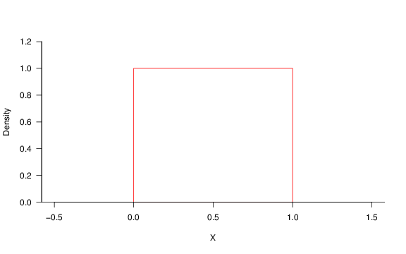
</figure>
</center>

If we draw 10$^6$ samples from this distribution, we can construct a histogram for $x$:

<center>
<figure>
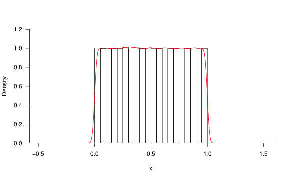
</figure>
</center>

For a uniform distribution $X\sim\mathbf{U}(a,b)$,
$$
\begin{aligned}
\E(X) &= \frac{1}{2}(a+b)\\
\Var(X) &= \frac{1}{12}(b-a)^2
\end{aligned}
$$

From a given (single) estimate of $\bar{x}$, let us test the hypothesis that $\mu_X \neq 0.5$ vs. $\mu_X = 0.5$ (so $\mu_0 = 0.5$ in our hypothesis testing framework). First, we will investigate the properties (distribution) of $\bar{X}$ so that we can place a single realization, $\bar{x}$, in context.

**Distribution of the sample mean $\bar{x}$ obtained from repeated sampling**

Let $\bar{X}$ be calculated from $n=50$ randomly selected samples. If we conduct an experiment where we draw 50 samples from this distribution for $N=30$ trials, the values would look as shown below. In each trial (shown along rows), we show red points indicating the mean values $\bar{x}$ for each of the 50 samples (gray points).

<center>
<figure>
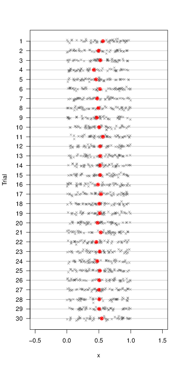
</figure>
</center>

If we draw a histogram of the 30 means $\bar{x}$, we see that the distribution is already approximately normal---*even though the distribution of $X$ is most definitely not normal*. An empirical density is overlaid in red.

<center>
<figure>
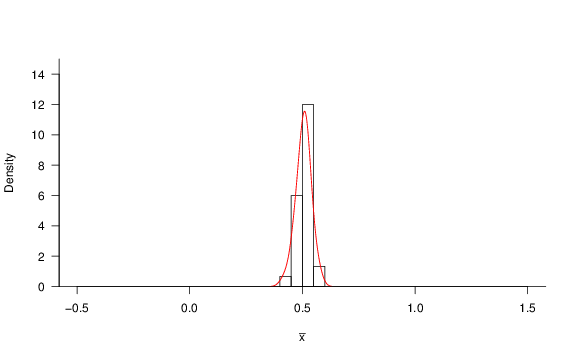
</figure>
</center>

Now let us repeat this experiment for $N \to \infty$ trials (actually, 10$^6$ in this case as $\infty$ is unachievable in reality) rather than just 30 times:

<center>
<figure>
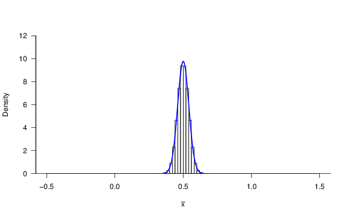
</figure>
</center>

We obtain the distribution for $\bar{X}$, also called the sampling distribution. It is normally distributed, with parameters $\mu_{\bar{X}} = \mu_{X}$ and $\sigma_{\bar{X}}^2 = \sigma_X^2/n$, as derived in previous lecture. The theoretical normal distribution $\mathbf{N}(\mu_{\bar{X}},\sigma_{\bar{X}})$ is overlaid in blue.

**Parameters of the sampling distribution (example: sample mean)**

$\bar{X}$ is a random variable which characterizes the mean of $n$ random variables $\{X_1, X_2, \dots, X_n\}$ with finite variance.
$$
\bar{X} = \frac{X_1 + X_2 + \ldots + X_n}{n} = \frac{X_1}{n} + \frac{X_2}{n} + \ldots \frac{X_n}{n}
$$

Since $\bar{X}$ is the sum of a number of other random variables, we can expect that its distribution is a normal. The expected value $\E(X)$ and variance $\Var(X)$ of this distribution are $\mu_{\bar{X}}$ and $\sigma_{\bar{X}}^2$, respectively.

There are properties of expected values and variances which are useful. For any random variable $X$ multiplied by a scalar variable $a$,
$$
\begin{aligned}
\E(aX) &= a\E(X)\\
\Var(aX) &= a^2 \Var(X)
\end{aligned}
$$

Therefore,
$$
\begin{aligned}
\mu_{\bar{X}} &= \frac{1}{n}(n \mu_X) = \mu_X \\
\sigma_{\bar{X}}^2 &= \frac{1}{n^2}(n\sigma_X^2) = \frac{\sigma_X^2}{n}
\end{aligned}
$$

The standard deviation of the sampling distribution, also called the *standard error*,  is $\sigma_{\bar{X}} = \sigma_X/\sqrt{n}$.


In reality, we do not have the ability to calculate $n$ means from $N\to\infty$ trials (10$^6$ for what is shown here). BUT, if we know $\mu_X$ and $\sigma_X$, then we know $\mu_{\bar{X}}$ and $\sigma_{\bar{X}}$ of the sampling distribution for $\bar{X}$ as shown above.

We expand the scale along the $x$-axis for better visibility in the figure below.

<center>
<figure>
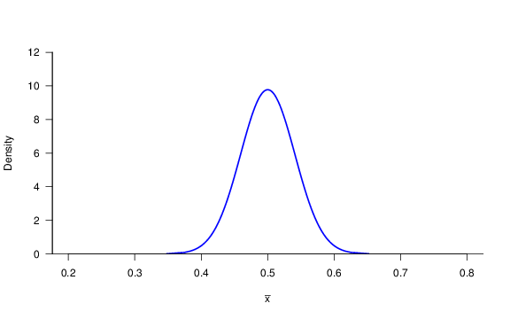
</figure>
</center>

If we calculate a mean value after sampling $n$ values only once from this distribution (what usually happens in environmental sampling), we get a point estimate of $\bar{X}$, shown by a red vertical line ($\bar{x}=0.53$).

<center>
<figure>
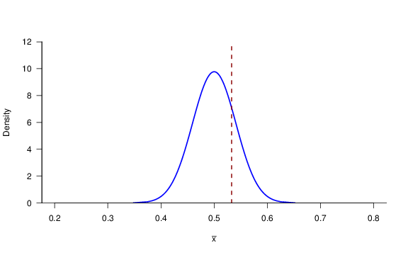
</figure>
</center>

### The sampling distribution

**Example: sampling means from a lognormal distribution**

Below, example lognormal distribution [Lausanne 2013 carbon monoxide, E(X) = 0.40] is shown at top. The three plot below show the distribution of mean values (*sampling distribution*) when the mean is calculated from $n$=10, 30, and 100 samples randomly selected from this distribution (process of random selection repeated 10,000 times for each scenario).

<center>
<figure>
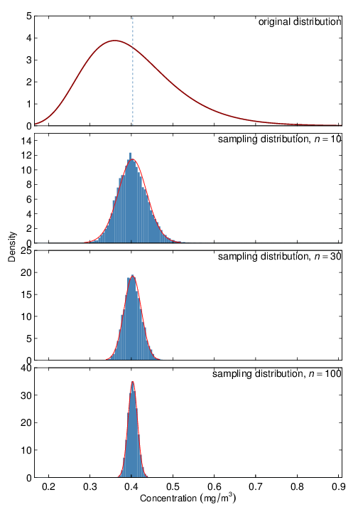
</figure>
</center>

* The distribution of the sampling distributions are normal, even though the original distribution is not.
* The standard deviations of the sampling distribution (*standard errors*) decrease with increasing number of $n$ (the decrease scales with $1/\sqrt{n}$).

We will see why confidence intervals are useful in the context of hypothesis testing.

### Confidence intervals

Confidence intervals on the mean can be constructed using the standard error. Let $X$ be a random variable.
\[
P\left( \mu_X - z \frac{\sigma_X}{\sqrt{n}} \leq \bar{X} \leq \mu_X +  z\frac{\sigma_X}{\sqrt{n}}\right) = p
\]
$z$ is the value of the $z$-score and $p$ is the confidence level (usually expressed as a percentage, $100p$, or $p$-value, which is actually $1-p$) associated with $z$. However, we seldom know $\mu_X$ and $\sigma_X$ but instead have set of $n$ observations from which we calculate the sample mean $\bar{x}$. With a given probability $p$, the sample mean is bounded by the true mean $\pm$ $z=z(p)$ times the standard deviation of the sampling distribution, which can be rewritten to state that the true mean is bounded by the sample mean and an interval derived from the estimated standard error. First statement:
\[
P\left( \bar{X} - z \frac{\sigma_X}{\sqrt{n}} \leq \mu_X \leq \bar{X} +  z\frac{\sigma_X}{\sqrt{n}}\right) = p
\]
Additionally, we also often do not know $\sigma_X$ but estimate $s$ from the same set of observations, so we use a different expression for the bounds (explained in the next section):
\[
P\left( \bar{X} - t \frac{s}{\sqrt{n}} \leq \mu_X \leq \bar{X} +  t\frac{s}{\sqrt{n}}\right) = p
\]
We can write these variations in a general form,
\[
P\left( \bar{X}-d \leq \mu_X \leq \bar{X}+d \right) = p
\]
The range $(\bar{X}-d,\bar{X}+d)$ associated with a particular confidence level $100p$ is called the confidence interval. Commonly used confidence levels include and 90\%, **95\%**, and 99\%, which correspond to $p$-values of 0.10, **0.05**, and 0.01, respectively.


### Student's $t$-distribution vs. normal distribution


Conceived by William S. Gosset under the pseudonym, Student, while employed at by Guiness brewery. Applied to statistics of small samples for dealing with chemical characterization of barley.

<center>
<figure>
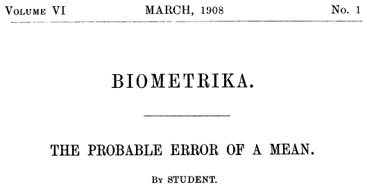
</figure>
</center>
<br>

* Suitable for capturing the longer-tailed feature of the sampling distribution when the number of samples is small ("frequency distribution of standard deviations of samples drawn from a normal population").
* Note that as $\nu \to \sim 30$, $t$-distribution converges to the normal distribution.

<center>
<figure>
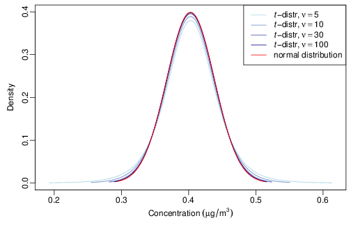
</figure>
<figcaption>
Title page from @Student1908.
</figcaption>
</center>
<br>

<center>
<figure>
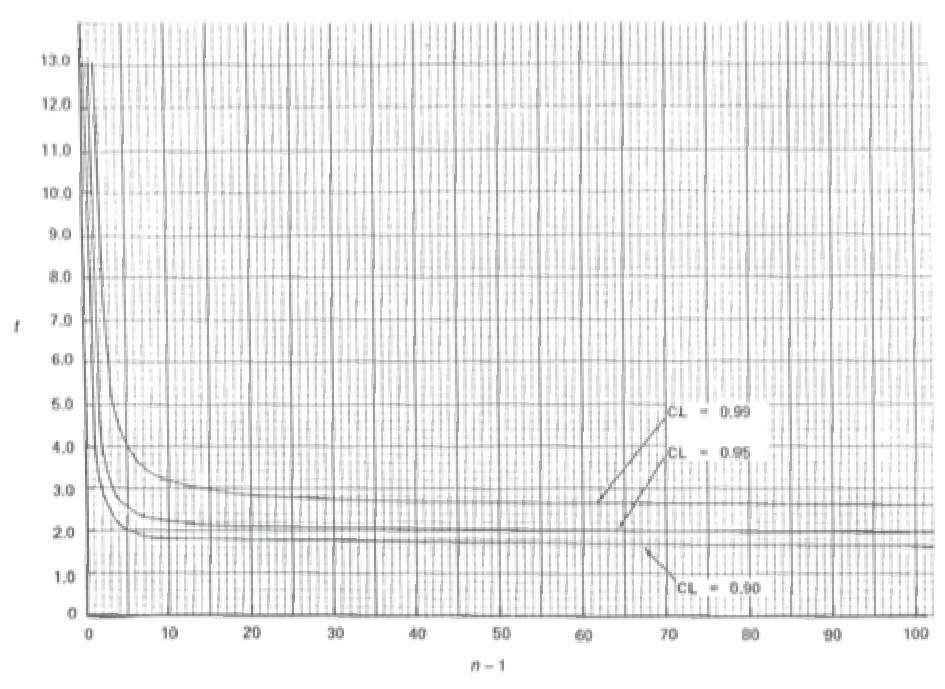
</figure>
<figcaption>
Figure 7.2 from @Ott1994.
</figcaption>
</center>
<br>

### Comparison of a mean against a fixed value

* $H_0$: sample belongs to population with known mean ($\mu = \mu_0$)
* $H_a$: sample belongs to another population with different means:  ($\mu > \mu_0$, $\mu < \mu_0$, or more generally $\mu\neq \mu_0$)

Test statistic:
$$
t = \frac{\bar{x} - \mu_0}{s/\sqrt{n-1}}
$$

Difference of two means:

* $H_0$: two populations characterized by random variables $X$ and $Y$ have the same means ($\mu_X = \mu_Y$).
* $H_a$: the two populations have different means ($\mu_X > \mu_Y$, $\mu_X < \mu_Y$, or more generally $\mu_X\neq \mu_Y$).

Test statistic:
$$
t = \frac{(\bar{x}-\bar{y}) - (\mu_X-\mu_Y)}{s_{\bar{X}-\bar{Y}}}
$$
where
$$
\begin{aligned}
s_{\bar{X}-\bar{Y}} &= \sqrt{s_X^2/n_X + s_Y^2/n_Y}\\
\nu &= \frac{s_X^2/n_X + s_Y^2/n_Y}{\left(s_X^2/n_X\right)^2/(n_X-1) + \left(s_Y^2/n_Y\right)^2/(n_Y-1)}
\end{aligned}
$$
$\nu$ is rounded to the nearest integer

**Formalizing comparisons within the hypothesis testing framework**

Let
$$
\begin{aligned}
  \alpha & = P(\text{type I error}) \\
  & = P(\text{reject $H_0$ when $H_0$ is true})
  \end{aligned}
  $$

  $\alpha$ is called the "significance level", and the confidence interval corresponds to $(1-\alpha)\times 100%$. E.g., defining an acceptance region for $H_0$ at the $\alpha=0.05$ significance level corresponds to a confidence interval of 95\%.
\medskip

To determine whether to reject $H_0$ or not, compare computed value of test statistic $t$ to fixed values $t_{\alpha,\nu}$ (one-sided) or $t_{\alpha,\nu/2}$ (two-sided) defined for $\nu$ (given by the data set) and $\alpha$ (determined by practioner).
\medskip

Let $T$ be a random variable representing the possible values of the $t$-statistic.

For the two-sided case, $t_{\alpha,\nu/2}$ (a positive value) is defined such that
\[
\alpha = P(T > t_{\alpha,\nu/2}) + P(T < -t_{\alpha,\nu/2})
\]

For the two-sided case, *we would reject the null hypothesis at the $\alpha$ significance level if $|t| > t_{\alpha,\nu/2}$*.


*Alternate method of presentation*. With a given set of data and test statistic, we can define the "$p$-value" as the smallest level of significance that would lead to rejection of the null hypothesis $H_0$. For the two-sided case, $p$-value corresponds to
    \[
    \text{$p$-value} = P(T > |t|) + P(T < -|t|)
    \]

We can make the statement that *we would reject the null hypothesis at the $\alpha=\{\text{$p$-value}\}$ according to our observations*. If the $p$-value is less than our specified value of $\alpha$, we can also state that we reject the null hypothesis at the $\alpha$ significance level.

<center>
<figure>
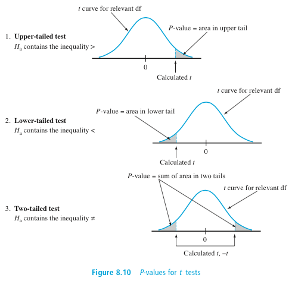
</figure>
<figcaption>
Figure 8.10 from @Devore2012.
</figcaption>
</center>
<br>

**Statistical vs. practical significance**

Note that even while there may be a statistical significance between two mean values, engineers must consider where the difference is of practical significance that would influence decision making or interperetation.


**The i.i.d. assumption**

Always note the assumptions required to estimate confidence intervals for each parameter.

Calculation of estimators often assumes samples are \textbf{i.i.d.}---**i**ndependent and **i**dentically **d**istributed random variables (have same probability distribution and are independently selected). As we saw in a previous lecture, air pollution concentrations often exhibit **serial correlation** (autocorrelation), so each sample is not truly independent. The implication would be that convergence to the mean will be more gradual than predicted by previously-derived expressions.

However, @Ott1981 have shown that the extent of autocorrelations in air pollution measurements do not affect estimated confidence intervals to a great extent.

<center>
<figure>
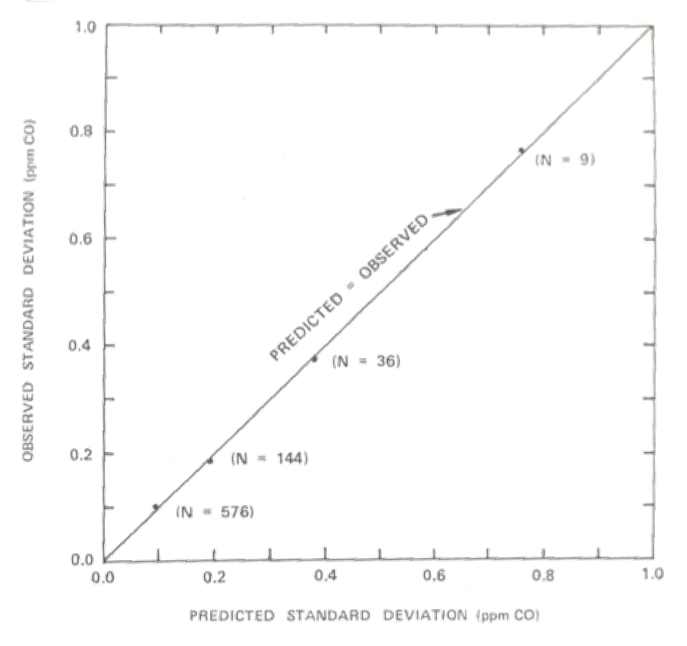
</figure>
<figcaption>
Figure 7.5 from @Ott1994.
</figcaption>
</center>
<br>

## Testing how well distribution fits

**Testing for goodness of fit**

Note there are many other (possibly better) goodness-of-fit tests, but the $\chi^2$ statistic is commonly used for this purpose and draws directly upon our previous discussion of hypothesis testing and $p$-values.

Essentially, the $\chi^2$ test compares sets of observed and expected frequencies: number of observations measured ($O_j$) and predicted ($E_j$) relative to the number predicted over $j=1,2,\ldots,m$ intervals.
\[
\chi^2 = \sum_{j=1}^m \frac{(O_j-E_j)^2}{E_j}
\]

*Fitting probability distributions*. For comparing against continuous distributions, we bin the observations as for a histogram. However, we target the creation of bin boundaries to contain equal counts of observations, rather than by criteria of even spacing.


This test statistic will have a probability distribution that is approximately $\chi^2$ (regardless of the underlying distribution of the observations) and the associated $p$-value can be estimated for $m-r-1$ degrees of freedom ($r$ is the number of parameters of the distribution).

<center>
<figure>
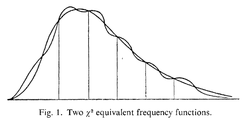
<figcaption>
Chi-square ($\chi^2$) goodness-of-fit test [Fig 10.1 from @Hoel1984].
</figcaption>
</figure>
</center>
<br>


We will use this statistic to test our hypotheses that the distribution is lognormally distributed:

* $H_0$: our observations are lognormally distributed
* $H_a$: our observations are not lognormally distributed

It is important to note that we assume the distribution is lognormal unless we have enough power to reject it. $p$-value $>$ 0.05 means the observations do not deviate enough from lognormally-distributed values to suggest that the true distribution is otherwise.

<center>
<figure>
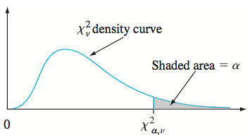
<figcaption>
Illustration of the $\chi^2$ distribution with critical region shaded in gray [Figure 14.1 from @Devore2012].
</figcaption>
</figure>
</center>
<br>

**Interpretation**

Why concentrations may be lognormally distributed:

* Pollutants arrive reach the stationary measurement station. This may help distinguish pollutants that arrive from long-range transport -- what we might refer to as "background".

Why concentrations may depart from lognormal distribution:

* mixing of sources (e.g., contribution from local sources)
* physical upper limit on concentration -- either at emission source or in the environment (lognormal distribution assumes upper limit is infinity)
* instrument detection limits lead to skewness in concentrations near zero
*

Further discussion can be found in the academic literature -- e.g., @Kao1995, @Hadley2003, @Morrison2010.

## Extension to other tests

**Wider application of hypothesis testing**

In this exercise, we examined an example of hypothesis testing of mean values and appropriateness for a particular distribution to describe a random variable.

Such tests can be performed on other parameters: standard deviations, regression coefficients (slope, intercept, etc.), correlation coefficients, and others. Examples:

* Test whether the intercept is different from zero
* Test whether the slope is different from zero
* Test whether two regression slopes are different from each other
* Test whether the correlation coefficient is different from zero

However, **always note the required assumptions** before performing tests for statistical inference.

<!-- Assumptions about the underlying distributions -->

As another exampe, it is often requested that tests of significance be provided for **the correlation coefficient between two analyte concentrations** (whether it is different from zero).

* The standard method for estimating confidence intervals requires that the joint probability distribution to be \textbf{bivariate normal} (i.e., the two variables correlated are both normally distributed); environmental pollutant concentrations are closer to being lognormally distributed.
* Additionally, all the observations are not independent, which may or may not affect the results of the test unless properly accounted for.
* *Therefore*, in these cases you will have to implement more sophisticated methods for estimating these confidence intervals, or refrain from making strong conclusions (i.e., remarks regarding  statistical significance) about the correlations.

<center>
<figure>
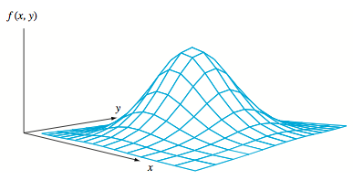
<figcaption>
A graph of a bivariate normal pdf [Figure 12.21 from @Devore2012].
</figcaption>
</figure>
</center>
<br>

## Hypothesis testing in modern discourse

Hypothesis testing and $p$-values are used extensively in the medical and psychological disciplines and is currently under intense scrutiny.

* [*Nature* **531**, 151; 2016](http://www.nature.com/news/statisticians-issue-warning-over-misuse-of-p-values-1.19503)

	> *P* values are commonly used to test (and dismiss) a 'null hypothesis' generally states that there is no difference between two groups, or that there is no correlation between a pair of characteristics. The smaller the $P$ value, the less likely an observed set of values would occur by chance - assuming that the null hypothesis is true.
	>
	> A *P* value of 0.05 does not mean that there is a 95% chance that a given hypothesis is correct. Instead, it signifies that if the null hypothesis is true, and all other assumptions made are valid, there is a 5% chance of obtaining a result at least as extreme as the one observed. And a P value cannot indicate the importance of a finding; for instance, a drug can have a statistically significant effect on patients' blood glucose levels without having a therapeutic effect.

* [*Nature* **519**, 9; 2015](http://www.nature.com/news/psychology-journal-bans-p-values-1.17001)

    > *P* values are widely used in science to test null hypotheses. For example, in a medical study looking at smoking and cancer, the null hypothesis could be that there is no link between the two. Many researchers interpret a lower *P* value as stronger evidence that the null hypothesis is false. Many also accept findings as 'significant' if the *P* value comes in at less than 0.05. But *P* values are slippery, and sometimes, significant *P* values vanish when experiments and statistical analyses are repeated (see [*Nature* **506**, 150-152; 2014](http://www.nature.com/news/scientific-method-statistical-errors-1.14700)).

* [*Nature* **520**, 612; 2015](http://www.nature.com/news/statistics-p-values-are-just-the-tip-of-the-iceberg-1.17412)

    > A more general problem is that "[a]rbitrary levels of statistical significance can be achieved by changing the ways in which data are cleaned, summarized or modelled."

* [*Nature* **506**, 150-152; 2014](http://www.nature.com/news/scientific-method-statistical-errors-1.14700)

    > Bottom line: the *P* value is not an absolute value that stands on its own. When reporting *P* values, it is important to thoroughly document the procedure of your analysis; including effect size and confidence intervals (which inherently includes sample size) to communicate the "magnitude and relative importance of an effect."

# R demonstration


```{r}
library(dplyr)
library(reshape2)
library(chron)
library(ggplot2)
```

```{r}
source("GRB001.R")
```

```{r, results="hide"}
Sys.setlocale("LC_TIME","C")
options(stringsAsFactors=FALSE)
options(chron.year.abb=FALSE)
theme_set(theme_bw()) # just my preference for plots
```

```{r}
df <- readRDS("data/2013/lau-zue.rds")
```

pivot to long format:
```{r}
id.vars <- c("site", "datetime", "year", "month", "day", "hour", "season", "dayofwk", "daytype")
lf <- melt(df %>% filter(site=="LAU"), id.vars=id.vars)
```

## Calculate metrics


Create a function to view some metrics:

```{r}
ComputeStats <- function(x) {
  x <- na.omit(x)
  m <- mean(x)
  s <- sd(x)
  n <- length(x)
  t <- qt(.975, n)
  data.frame(mean=m,
             conf.lower=m-t*s/sqrt(n),
             conf.upper=m+t*s/sqrt(n),
             sd.lower=m-s,
             sd.upper=m+s)
}
```

Apply to ozone concentrations in January and July:

```{r}
table <- lf %>% filter(variable=="O3" &
                       month %in% c("Jan","Jul"))

mystats <- table %>%
  group_by(month, daytype) %>%
  do(ComputeStats(.[["value"]]))

head(mystats)
```

Summarize variability:

```{r}
ggp <- ggplot(table)+
  geom_boxplot(aes(daytype, value))+
  facet_wrap(~month)
print(ggp)
```


```{r}
ggp <- ggplot(mystats)+
  geom_bar(aes(x=daytype, y=mean), stat="identity", fill="gray")+
  geom_errorbar(aes(x=daytype,
                    ymin=sd.lower,
                    ymax=sd.upper),
                width=0.1)+
  facet_wrap(~month)
print(ggp)
```

Uncertainty in calculated means:

```{r}
ggp <- ggplot(mystats)+
  geom_bar(aes(x=daytype, y=mean),
           stat="identity", fill="gray")+
  geom_errorbar(aes(x=daytype,
                    ymin=conf.lower,
                    ymax=conf.upper),
                width=0.1)+
  facet_wrap(~month)
print(ggp)
```

We can also compute the corresponding $t$-statistic.

Just taking the month of July for example,

```{r}
(out <- t.test(filter(table, month=="Jul" & daytype=="Weekend")[["value"]],
               filter(table, month=="Jul" & daytype=="Weekday")[["value"]],
               alternative="greater"))

```

its $p$-value can be retrieved with this syntax:

```{r}
out[["p.value"]]
```

Since the $p$-value is less than $\alpha=0.05$, we can say that we would reject the null hypothesis (that on average, the weekend concentrations are the same as weekday concentrations) at the $\alpha=0.05$ significance level.


## Fitting probability distributions


 We can use the fitdistrplus library available in R:

```{r}
library(fitdistrplus)
```

The `fitdist` function fits a distribution by maximum likelihood by default (see `?fitdist` for more information). Let is fit a lognormal distribution (`"lnorm"`), which also produces a plot:
```{r}
hourly <- lf %>% filter(month=="Jul" & variable=="NO2")
concvec <- c(na.omit(hourly[["value"]]))
fit <- fitdist(concvec, "lnorm")
```

Print output:
```{r}
print(fit)
```

Print Goodness-of-Fit statistics (see `?gofstat` for more information):
```{r}
print(gofstat(fit))
```

Extracting $p$-value of chi-square test:
```{r}
(pval.h <- gofstat(fit)[["chisqpvalue"]])
```

Plot:
```{r, fig.width=7, fig.height=7}
plot(fit)
```

### The P-P plot

The P-P plot compares the theoretical and empirical cumulative distribution functions (CDFs).

* The theoretical CDF is given by $F_X(x)$ constructed using parameters of the distribution estimated from the data (in this case, $\mu$ and $\sigma$ of the lognormal distribution).
* The ECDF was defined in a previous lesson:
$$
\hat{F}_X(x) = \frac{1}{n} \Big{|}\{x_i \leq x \, : \, i=1,2,\ldots,n\}\Big{|}
$$

If the proposed distribution is a "good fit" and the parameters have been estimated correctly, the points generally fall on the 1:1 line. See [this page](http://stats.stackexchange.com/a/101290/1021) for illustrations of various departures from this condition.

### The Q-Q plot

The Q-Q (quantile-quantile) plot compares quantiles (values of $x$) from the theoretical and empirical CDFs.

* Given theoretical CDF $F_X(x)$ constructed from a lognormal model fitted to the data, $p = F_{X}(x) \Rightarrow x = F_{X}^{-1}(p)$:
$$
\text{theoretical quantile($p$)}= F_{X;\hat{\mu},\hat{\sigma}}^{-1}(p)
$$
The hat over the symbols indicate the parameters estimated from the data.
* Empirical cumulative distribution function (CDF) for a given probability $p$:
$$
\text{empirical quantile($p$)}=\min\{x : \text{proportion of $p$ of the data $\leq x$}\}
$$

If the proposed distribution is a "good fit" and the parameters have been estimated correctly, the points generally fall on the 1:1 line. See [this page](http://stats.stackexchange.com/a/101290/1021) for illustrations of various departures from this condition.

The Q-Q plot is generally more popular than the P-P plot, though they can indicate complementary information. For instance, the Q-Q plot is more sensitive to departure from the distribution at the extremes, while the P-P plot highlights departures that occur near the center of the distribution (note that the P-P plot limits are bounded by 0 and 1, while they are not bounded for the Q-Q plot).

<!-- ### Daily-averaged measurements -->

<!-- Arithmetic averaging of measurements can potentially downplay the physical limit on concentration. ? -->


<!-- ```{r} -->
<!-- daily <- lf %>% -->
<!--   filter(month=="Jul" & variable=="NO2") %>% -->
<!--   group_by(year, month, day) %>% -->
<!--     summarize(value=mean(value, na.rm=TRUE)) -->

<!-- concvec <- c(na.omit(daily[["value"]])) -->
<!-- fit <- fitdist(concvec, "lnorm") -->
<!-- ``` -->

<!-- ```{r} -->
<!-- print(fit) -->
<!-- ``` -->

<!-- ```{r} -->
<!-- print(gofstat(fit)) -->
<!-- ``` -->

<!-- Extract $p$-value of chi-square test: -->
<!-- ```{r} -->
<!-- (pval.d <- gofstat(fit)[["chisqpvalue"]]) -->
<!-- ``` -->

<!-- ```{r, fig.width=7, fig.height=7} -->
<!-- plot(fit) -->
<!-- ``` -->

<!-- ### Summarizing $p$-values -->

<!-- Horizontal line corresponds to $\alpha$=0.05 level. -->

<!-- ```{r} -->
<!-- pvalues <- data.frame(resolution=c("hourly","daily"), pvalue=c(pval.h, pval.d)) -->

<!-- ggp <- ggplot(pvalues)+ -->
<!--   geom_bar(aes(resolution, pvalue), stat="identity", fill="gray")+ -->
<!--   geom_hline(yintercept=0.05, linetype=2)+ -->
<!--   xlab("Time resolution")+ -->
<!--   ylab(expression(italic(p)*"-value"))+ -->
<!--   ggtitle("p-values for chi-square test, NO2 in July, Lausanne") -->

<!-- print(ggp) -->
<!-- ``` -->

**If you have negative concentrations**

This may prevent you from testing whether your data is lognormally
distributed or not (i.e., the function call to `fitdist()` fails). The
following function will replace values less than or equal to zero with the minimum positive
value otherwise observed for each data set:
```{r}
ReplaceNonpositive <- function(x) {
  x <- na.omit(x)
  min.positive.value <- min(x[x>0])
  replace(x, x < min.positive.value, min.positive.value)
}
```

Example usage:
```{r, eval=FALSE}
fit <- fitdist(ReplaceNonpositive(concvec), "lnorm")
```
Here we have introduced an approximation to the observed measurements. Alternatively, you may consider replacing values $< 0$ with 1/2 the minimum detection limit if this information is available. While there exist some studies on the effect of such choices on a variety of estimates or statistical tests, for this specific instance the effect is not known as the sensitivity to various approximatoins are not explicitly explored.  In any case, you should adopt the practice of reporting such "pretreatment" of the data in your analysis.

# References
