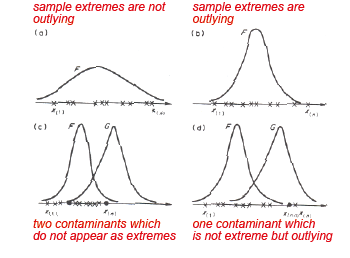
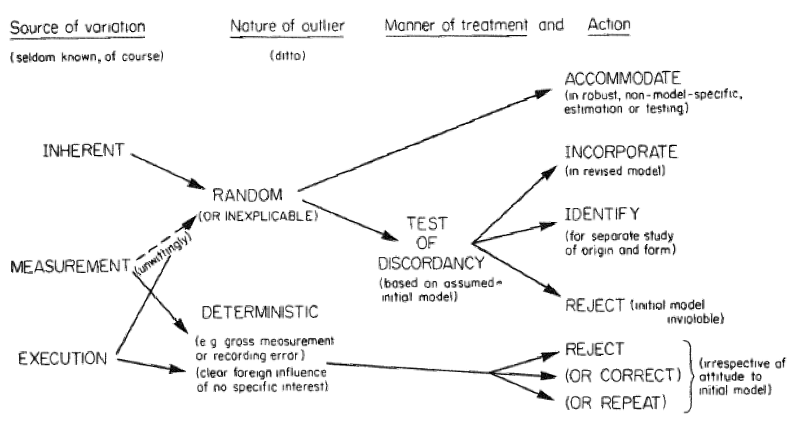

```{r, include=FALSE}
library(knitr)
opts_chunk$set(fig.path='figures_rmd/lec09_', fig.align='center', warning=FALSE, message=FALSE)
```

\newcommand{\mean}{\operatorname{mean}}
\newcommand{\median}{\operatorname{median}}
\newcommand{\E}{\operatorname{E}}
\newcommand{\Var}{\operatorname{Var}}
\newcommand{\erf}{\operatorname{erf}}
\DeclarePairedDelimiter{\ceil}{\lceil}{\rceil}

# Background

**Motivation**

In hourly concentrations plotted below for 2013 in Lausanne (LAU) and Zurich (ZUE), we can identify several extreme values. We will particularly focus on the PM$_{10}$ and EC concentrations in Zurich and examine them further.
<center>
<figure>

</figure>
</center>

**Outline**

Previously, we have used various tools to describe overall trends and relationships among variables:

* Visualization:
    * Time series
    * Probability distributions
* Summarize general behavior of pollutant concentrations by location/time using summary statistics.
* Test hypotheses regarding the role of meteorology, atmospheric processes (including dispersion and photochemistry), and emissions to changes in observed concentrations:
    * Changes in concentrations to time (hour of day, weekday/weekend, season) indicate role of meteorology, emissions, and photochemistry.
    * Scatter plots and correlations indicate relationships among co-occuring pollutants and meteorological variables.
    * Distribution of pollutant concentrations can indicate dominant processes affecting pollutant concentrations in the atmosphere.

In this module, we will learn methods to identify observations *which fall outside of general patterns described previously*.

We will discuss methods for handling observations which fall outside of the general patterns reflected by aggregate measures (summary statistics) of pollutant concentrations so far. These surprisng data points may arise from experimental error, anamolous activity, or unusual meteorology. Their identification may be useful in  re-calculating summary statistics which are more representative of the rest of the data points that are not unduely influenced by one or few points, and/or isolating extreme events for further study.

## Extreme values and outliers

For a thorough treatment of this topic, see @Barnett1994 from which much of this material has been taken.

In practice, univariate or multivariate observations that fall outside of the general patterns ("extreme values") are informally separated and removed, or reserved for further analysis.

* In some cases, log books recording accounts of calibrations dates, measurement conditions, and unusal events will reveal the nature of these extreme observations (this is always the first step).
* An outlier or extreme value is sometimes removed from a data set for lack of  representativeness, but it should always be noted that data points have been removed, and  accompanied by justification.


We will discuss statistical procedures for identifying "outliers" among extreme values in the univariate case, which will provide an appropriate perspective for thinking about extreme observations in the general (multivariate) case.

<center>
<figure>

</figure>
<figcaption>
Extreme values and outliers [Figure 1.3 from @Barnett1994].
</figcaption>
</center>

<!-- p. 4 BnL -->

Definitions:

* Extreme value: an observation with value at the boundaries of the domain.
* Outlier: an observation which appears to be inconsistent with the remainder of that set of data.
* Contaminant: an observation which originates from another population/distribution.

The decision to label an observation as an outlier is made with consideration to the greater set of observations to which it belongs.


Treatment of outliers

<center>
<figure>

</figure>
<figcaption>
Figure 2.1 from @Barnett1994.
</figcaption>
</center>

## Tests of discordancy

**Hypothesis testing framework**

We will discuss some conceptual ways to think about extreme values and outliers.

The statistical basis is classifying an extreme value as an outlier originates from a hypothesis testing framework.


<center>
<table cellpadding="10">
<tr style="padding-left:5px;padding-right:5px;border-bottom: 1px solid #000;">
<th> Decision </th><th> $H_0$ True </th><th> $H_a$ </th>
</tr>
<tr style="border-bottom: 1px solid #000;">
<td align="center" style="padding-left:5px;padding-right:5px;"> reject $H_0$ </td>
<td align="center" style="padding-left:5px;padding-right:5px;"> *Type I error* ($\alpha$) </td>
<td align="center" style="padding-left:5px;padding-right:5px;"> Correct decision  </td>
<tr style="border-bottom: 1px solid #000;">
<td align="center" style="padding-left:5px;padding-right:5px;"> do not reject $H_0$ </td>
<td align="center" style="padding-left:5px;padding-right:5px;"> Correct decision </td>
<td align="center" style="padding-left:5px;padding-right:5px;"> *Type II error*  ($\beta$) </td>
</tr>
</table>
</center>
<br>

* *Type I error*: rejecting null hypothesis when it is true.
* *Type II error*: failing to reject the null hypothesis when the alternative hypothesis is true.


A discordant observation is one that is statistically unreasonable with respect to prescribed probability model.

**Conceptual framework**

Statistical tests require a comparison of a working (null) hypothesis and an opposing alternative hypothesis.

*Working hypothesis*:

The data arise from some common but unspecified distribution $F$ (i.e., a population characterized by the distribution $F$).
\[
H_0: F
\]

*Some alternative hypotheses*:

* *Deterministic alternative*. Instead of the possibility that all observations arise from $F$, all samples $x_i$ except $i\neq j$ arise from $F$ and $x_j$ is an isolated and sufficiently different type of observation which requires rejection.
\[
H_a: \{x_i \sim F : i \neq j\}; \ \text{$x_j$ does not belong to $F$}
\]
"Deterministically correct" in gross measurement error scenario.

* *Inherent alternative*. All observations arise not from $F$ but from another distribution, $G$, from which the extreme values are no longer surprising or inconsistent with respect to the new probability model.
\[
H_a: G
\]
* *Mixture alternative*. The population does not all belong to the population characterized by $F$, but a mixture of two populations characterized by $F$ and $G$, and the degree of mixing (fraction) $\lambda$. Samples from population $G$ appears as extreme values in the set of data which are mostly comprised of samples from $F$.
\[
H_a: (1-\lambda) F + \lambda G
\]
$\lambda$ would necessarily be small; therefore, estimating $\lambda$ and $G$ would typically be difficult in real data sets, but the conceptual idea is that samples from two separate distributions are present in the sample.


### Tests of discordancy


* Many tests of discordancy assume underlying distributions that are parametric: e.g., uniform, normal, lognormal, etc. (and many others). Written as $F\sim f(X,\theta_f)$ and $G\sim g(X,\theta_g)$, we can see that estimation of distribution parameters $\theta_f$, $\theta_g$ may pose challenges when they must be estimated from (statistically) contaminated data [i.e., $x_j$ or $\lambda$ must be estimated simultaneously].
* *Robust statistics* provides a set of tools by which estimates of distribution parameters can be obtained with minimized influence from (statistical) contaminants.
* Alternative and simpler test metrics for identifying outliers exist, and are frequently used (because they are simpler).
* In real applications, each extreme value or set of extreme values should be evaluated (and removed/accommodated) according to best judgement. These observations should be recorded and reported.


### Test metrics

There are several *types* of metrics, three of which are shown here with example implementations.

* *Excess/spread statistics*. Ordering our set of observations $\{x_1, x_2, \ldots, x_n\}$ by magnitude such that we have $\{x_{(1)}, x_{(2)}, \ldots, x_{(n)}\}$
If we hypothesize that $x_{(n)}$ is an upper outlier (Dixon, 1951; omitting $x_{(1)}$),
\[
\frac{x_{(n)} - x_{(n-1)}}{x_{(n)}-x_{(2)}}
\]
E.g., Dixon Q-test.
* *Extreme/location statistics*. Also evaluating that $x_{(n)}$ is an upper outlier, the test metric is
\[
\frac{x_{(n)}}{\bar{x}}
\]
* *Sum of squares statistics*. Testing two upper outliers $x_{(n-1)}, x_{(n)}$,
\[
\frac{\sum_{i=1}^{n-2} (x_{(i)} - \bar{x}_{(n),(n-1)})^2}{\sum_{i=1}^{n} (x_{i})^2}
\]


## Accommodating outliers

For a thorough treatment of this topic, see @Venables2003 from which much of this material has been taken.

*Why will it not suffice to screen data and remove outliers?* [@Venables2003]

1. Users, even expert statisticians, do not always screen the data.
2. The sharp decision to keep or reject an observation is wasteful. We can do better by down-weighting dubious observations than by rejecting them, although we may wish to reject completely wrong observations.
3. It can be difficult or even impossible to spot outliers in multivariate or highly structured data.
4. Rejecting outliers affects the distribution theory, which ought to be adjusted. In particular, variances will be underestimated from the "cleaned" data.


### Robust estimators

**For the sample mean**.

Let
\[
\tilde{\mu} = \sum c_i x_{(i)}
\]

* *Median*. $c_i = 0$ for all but the middle or two middle observations.
* $\alpha$-*trimmed mean*. Some proportion $\alpha$ of observations are omitted. For example, if $\alpha\cdot n = 2 \Rightarrow c_1 = c_n = 0, c_i = 1/(n-2)$ for $i=3,4,\ldots,n-2$.
* *Winsorized mean*. Collapse most extreme (upper and lower) sample values to their nearest neighbors in ordered samples and taking unweighted average. For example, $c_1 = c_n = 0, c_2 = c_{n-1} = 2n, c_i = 1/n$ for $i=3,4,\ldots,n-2$.
<!-- p.26 BnL -->

(For further generalization of these concepts, read further on "robust statistics"; $L$- and $M$-estimators.)

**For the sample standard deviation**.

* Interquartile range (*IQR*) = $F^{-1}_X(0.75) - F^{-1}_X(0.25)$. For the normal distribution, $\textit{IQR} \approx 1.35\sigma$.
* Median absolute deviation (*MAD*) = $\underset{i}{\median}\left\{ \Big{|}Y_i - \underset{j}{\median}(Y_j)\Big{|}\right\}$. For the normal distribution, $\textit{MAD} \approx 0.6745\sigma$.

There are many other types of robust estimators for these parameters; also for regression coefficients, etc.


### Desired properties of estimators

*I.e., why not use robust estimators all the time?*

(Note that an *estimator* is not the same as an *estimate*, which is only a single  realization of an estimator.


Generally, estimators which are *unbiased* with *low variance* are desired.

* Bias: $B(\hat{\theta}) = \E(\hat{\theta}) - \theta$
* Variance: $\Var(\hat{\theta}) = \E\left(\left[\hat{\theta}-\E(\hat{\theta})\right]^2\right)$

These properties have consequences for conclusions we draw from hypothesis testing (and problems in statistical inference in general). For descriptive statistics, high variance of an estimator may be less of an issue (though the bias of any single estimate may be greater).


<!-- % Consistency. As the sample size increases, the sampling distribution of the estimator becomes concentrationed around the true value of the parameter being  estimated -->

Unbiased estimators have the property that the difference in expected value of the estimator and the true parameter is zero, on average:
\[
B(\hat{\theta}) = 0
\]
We can describe the variance of an estimator $\tilde{\theta}$ against another (benchmark) estimator $\hat{\theta}$, by its asymptotic relative efficiency.
\[
\textit{ARE}(\tilde{\theta};\hat{\theta}) = \lim_{n\to\infty} \frac{\Var(\hat{\theta})}{\Var(\tilde{\theta})}
\]
<!-- %% Unspecified $\hat{\theta}$ implies comparison to the optimal estimator, written below as $\textit{ARE}(\tilde{\theta};\cdot)$. -->
For example, some *ARE*s for random variables with specific distributions are shown below:

<center>
<table>
<tr style="border-bottom: 1px solid #000;">
<th> Distribution </th><th> *ARE* </th>
</tr>
<tr>
<td> normal </td><td> $\textit{ARE}(\median; \mean) \approx 64\%$ </td>
</tr>
<tr>
<td> Student's $t$ </td><td> $\textit{ARE}(\median; \mean) \approx 96\%$ </td>
</tr>
<tr>
<td> normal </td><td> $\textit{ARE}(MAD;\text{std.~dev.}) \approx 37\%$ </td>
</tr>
</table>
</center>

The median perform betters for longer-tailed distributions; *MAD* (and *IQR*) are robust with respect to outliers, but not very efficient.

There are other estimators with properties which are desirable in certain contexts, and the user should be aware of these properties and select according to specific needs (for descriptive and inferential statistics).

# R demonstration


```{r}
library(dplyr)
library(reshape2)
library(chron)
library(ggplot2)
```

```{r}
source("GRB001.R")
```

```{r, results="hide"}
Sys.setlocale("LC_TIME","C")
options(stringsAsFactors=FALSE)
options(chron.year.abb=FALSE)
theme_set(theme_bw()) # just my preference for plots
```

```{r}
df <- readRDS("data/2013/lau-zue.rds")
```

Pivot to long format:
```{r}
id.vars <- c("site", "datetime", "year", "month", "day", "hour", "season", "dayofwk", "daytype")
lf <- melt(df, id.vars=id.vars)
```

## Identifying extreme values

### Hourly values

Select at PM$_{10}$ for Zurich.

```{r}
pm10.zue <- filter(lf, site=="ZUE" & variable=="PM10")
pm10.zue[["date"]] <- format(dates(pm10.zue[["datetime"]]), "y.m.d")
pm10.zue[["day"]] <- as.numeric(as.character(pm10.zue[["day"]]))
```

View the time series.

```{r, fig.width=15, height=3}
ggp <- ggplot(mutate(pm10.zue, day.of.month=day+hour/24))+
  geom_line(aes(day.of.month, value))+
  facet_grid(.~month)+
  xlab("Day")+
  ylab(expression("PM"[10]~"concentration"~(mu*g/m^3)))
print(ggp)
```

View the PDF/ECDF.

```{r}
ggp <- ggplot(pm10.zue, aes(x=value))+
  geom_line(stat="density", position="identity")+
  geom_point(y=0, shape=4)+
  xlab(expression("Hourly PM"[10]~"concentration"~(mu*g/m^3)))+
  ylab("Probability density")
print(ggp)
```

```{r}
ggp <- ggplot(pm10.zue, aes(value))+
  geom_line(stat="ecdf")+
  geom_point(stat="ecdf")+
  xlab(expression("Hourly PM"[10]~"concentration"~(mu*g/m^3)))+
  ylab("Probability")
print(ggp)
```

We select periods for which the concentration was greater than 100 $\mu$g/m$^3$.
```{r}
(highvals <- filter(pm10.zue, value > 100))
```

Notable dates:

* 01.01.2013 is New Years Day
* 01.08.2013 is Swiss National Day


View the diurnal variations for these days.

```{r}
highdays <- filter(pm10.zue, date %in% highvals[["date"]])
```

```{r, fig.width=15, fig.height=3}
ggp <- ggplot(highdays, aes(hour, value))+
  geom_line()+
  geom_point()+
  facet_grid(.~date)+
  xlab("Hour of day")+
  ylab(expression("PM"[10]~"concentration"~(mu*g/m^3)))
print(ggp)
```

We see that despite these periods of high concentration, the mean daily values are still below the limit of 50 $\mu$g/m$^3$.

```{r}
highdays %>% group_by(date, variable) %>%
  summarize(value=mean(value))
```

As a rather uninteresting example, we can use a trimmed mean as a robust estimator of the mean. Notice that the mean is less influenced by the presence of extreme values. (Note that 10\% corresponds to $\lceil{24\times{}.1}\rceil=2$ observations removed.)

```{r}
highdays %>% group_by(date, variable) %>%
  summarize(value=mean(value, trim=0.1))
```

Under what conditions do PM$_{10}$ concentration exceed regulatory limits?

### Daily values: PM$_{10}$ example


Calculate daily means.

```{r}
daily <- pm10.zue %>%
  group_by(date, variable) %>%
  summarize(month=month[1],
            day=day[1],
            value=mean(value,na.rm=TRUE))
```


View the time series.

```{r, fig.width=15, fig.height=3}
ggp <- ggplot(daily)+
  geom_line(aes(day, value))+
  facet_grid(.~month)+
  xlab("Day")+
  ylab(expression("PM"[10]~"concentration"~(mu*g/m^3)))
print(ggp)
```


View PDF/ECDF of daily means.

```{r}
ggp <- ggplot(daily)+
  geom_line(aes(x=value), stat="density", position="identity")+
  geom_point(aes(x=value), y=0, shape=4)+
  geom_vline(xintercept=50, linetype=2)+
  xlab(expression("Daily Mean PM"[10]~"concentration"~(mu*g/m^3)))+
  ylab("Probability density")
print(ggp)
```


```{r}
ggp <- ggplot(daily, aes(value))+
  geom_line(stat="ecdf")+
  geom_point(stat="ecdf")+
  geom_vline(xintercept=50, linetype=2)+
  xlab(expression("Daily Mean PM"[10]~"concentration"~(mu*g/m^3)))+
  ylab("Probability")
print(ggp)
```

If we observe concentrations for days in which the 50 $\mu$g/m$^3$ limit is exceeded, we find that the concentrations are generally high throughout the day, and persist for more than a day at a time.


```{r}
exceeded <- filter(daily, value > 50)
```

```{r, fig.width=15, fig.height=3}
ggp <- ggplot(filter(pm10.zue, date %in% exceeded[["date"]]), aes(hour, value))+
  geom_line()+
  geom_point()+
  facet_grid(.~date)+
  xlab("Hour of day")+
  ylab(expression("PM10 concentration"~(mu*g/m^3)))+
  scale_y_continuous(limits=c(0,100))
print(ggp)
```

## Tests of discordancy

In this section, we will examine EC (elemental carbon) concentrations from Zurich.

```{r}
ec.zue <- filter(lf, site=="ZUE" & variable=="EC")
```

We can view its ECDF:

```{r}
ggp <- ggplot(ec.zue, aes(x=value))+
  geom_line(stat="ecdf")+
  geom_point(stat="ecdf")+
  xlab("EC concentration"~(mu*g/m^3))+
  ylab("Probability")
print(ggp)
```

Let us select the day with the highest value:

```{r}
anomolous.day <- filter(ec.zue, dates(datetime) == dates(datetime[which.max(value)]))
```

Visualizing the time series for this day only, we see that it happens late at night on 1 August:

```{r}
ggp <- ggplot(anomolous.day, aes(hour, value))+
  geom_line()+
  geom_point()+
  xlab(paste("Hour of day", dates(anomolous.day[1,"datetime"])))+
  ylab("EC concentration"~(mu*g/m^3))
print(ggp)
```

*Clearly*, this point is an outlier? It is often convenient to state a criterion by which a measurement is labeled as an outlier (rather than simply an extreme value). This may not mean it is a bad measurement, but that it falls out of expected trends - may be used to motivate periods for further study.

R includes a Dixon test where the test statistic is compared against a distribution tabulated by Dixon. A $p$-value is provided with respect to this distribution, but  only for small sample sets (<30)---presumably a limitation of the available tabulated values.

```{r}
require(outliers)

test.out <- dixon.test(anomolous.day[["value"]], two.sided=FALSE)

print(test.out)
```

As we observed, structured observations like measurements of time series will have additional information---for instance, the position of the observation in a sequence, relationship to other variables---to provide further assessment on the discordancy of an observation (or observations). All information that you have at your disposal should be used to make sense of these values.


## Accommodation

We will compute several metrics for characterizing the central tendancy and dispersion in a univariate sample. For this we define several functions.

Note that for a normal distribution, $\textit{IQR} \approx 1.35\sigma$ and $MAD \approx 0.6745\sigma$ [@Venables2003]. The `mad` function returns *MAD*/0.6745 rather than *MAD* itself.

Again for a normal distribution, the integrated area between $\pm 1\sigma$ is 66\%, whereas for *IQR* it is necessarily 50\% by definition (regardless of distribution).


```{r}
WinsorizedMean <- function (x, frac=.05, ...) {
  ## x is a vector of values
  ## frac is the fraction to replace at each end
  lim <- quantile(x, c(frac/2, 1-frac/2), ...)
  x[x < lim[1]] <- lim[1]
  x[x > lim[2]] <- lim[2]
  mean(x, ...)
}

ComputeCentral <- function(x) {
  ## x is a vector of values
  metric <- c("mean"            = mean(x, na.rm=TRUE),
              "median"          = median(x, na.rm=TRUE),
              "trimmed.mean"    = mean(x, trim=0.05, na.rm=TRUE),
              "Winsorized.mean" = WinsorizedMean(x, frac=0.05, na.rm=TRUE))
  data.frame(metric=factor(names(metric), names(metric)), value=metric)
}

ComputeDispersion <- function(x) {
  ## x is a vector of values
  metric <- c("sd"    = sd(x, na.rm=TRUE),
              "IQR"   = IQR(x, na.rm=TRUE),
              "MAD"   = mad(x, na.rm=TRUE))
  data.frame(metric=factor(names(metric), names(metric)), value=metric)
}
```


Compare central metrics:
```{r}
metric.central <- lf %>% group_by(site, variable) %>%
  do(ComputeCentral(.[["value"]]))
```

```{r, fig.width=5, fig.height=10}
ggp <- ggplot(metric.central)+
  geom_bar(aes(metric, value), stat="identity", fill="gray")+
  facet_grid(variable~site, scale="free_y")+
  xlab("")+
  theme(axis.text.x = element_text(angle = 90, hjust = 1))
print(ggp)
```

Compare dispersion metrics:
```{r}
metric.disp <- lf %>% group_by(site, variable) %>%
  do(ComputeDispersion(.[["value"]]))
```

```{r, fig.width=5, fig.height=10}
ggp <- ggplot(metric.disp)+
  geom_bar(aes(metric, value), stat="identity", fill="gray")+
  facet_grid(variable~site, scale="free_y")+
  xlab("")+
  theme(axis.text.x = element_text(angle = 90, hjust = 1))
print(ggp)
```

## Interpretation

Possible causes?

* Anamolous meteorology (e.g., synoptic-scale events)
* Unusual emissions
* Low boundary layer height
* ...

Strageties:

* Check if concentration of other pollutants also anomolously high, PM$_{10}$ at sites nearby also high, etc.


# References
